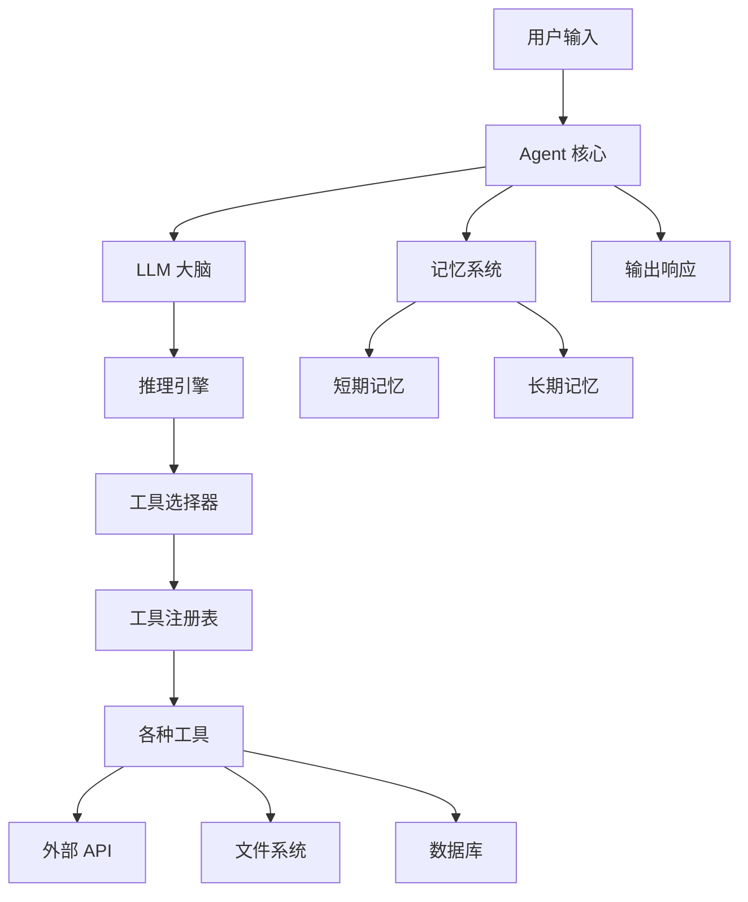
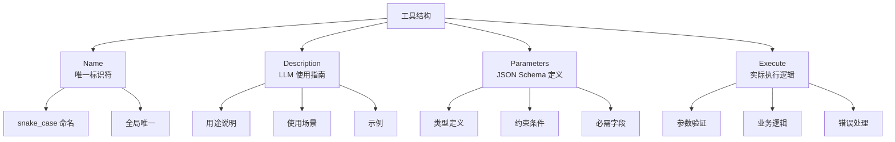
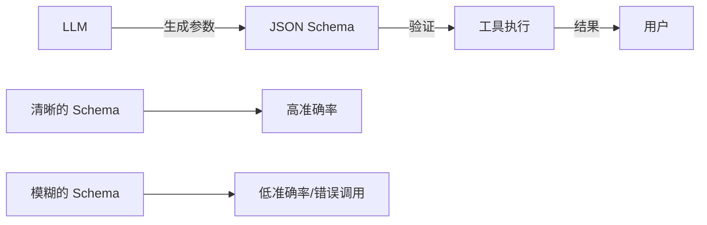
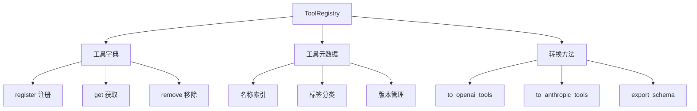
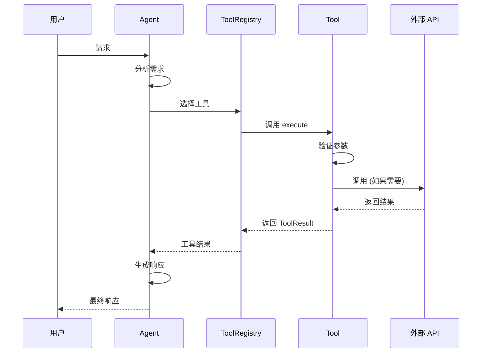
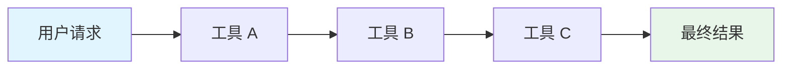
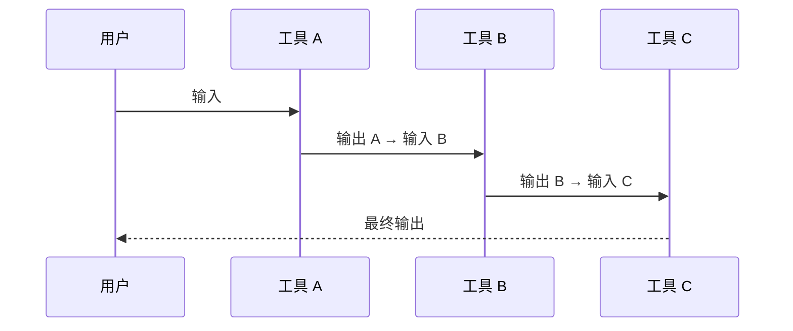
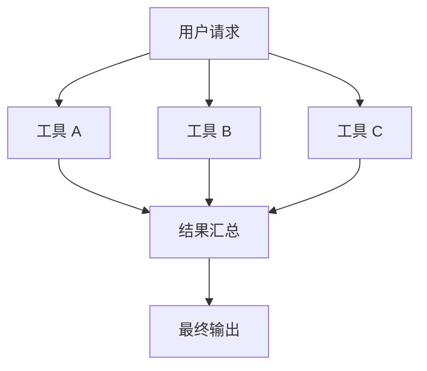
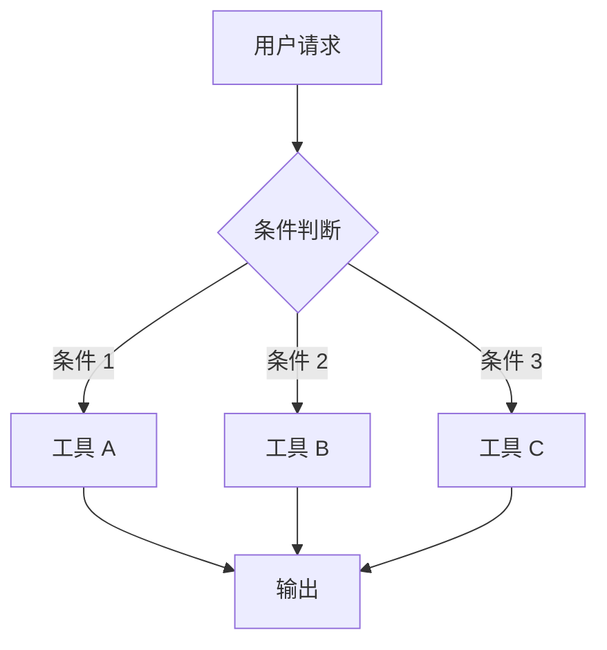
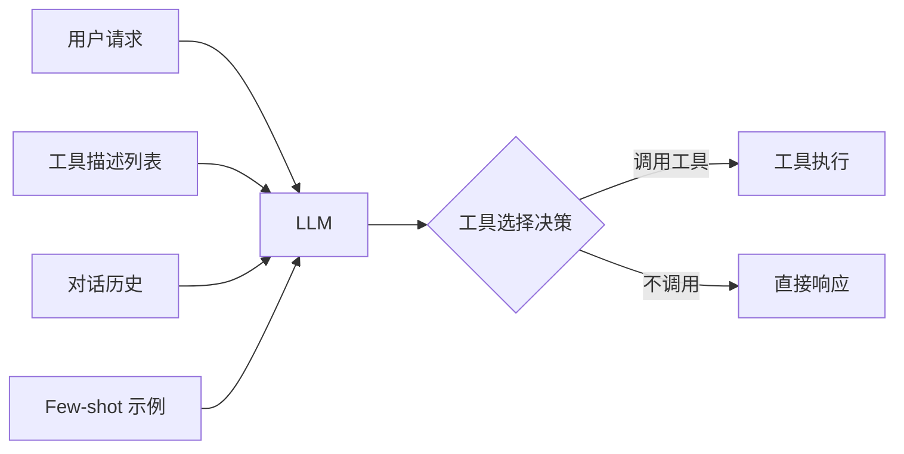

# 第三章 工具系统详解

> **本章导语**：工具是 Agent 的"双手"，让 AI 能够与外部世界交互。本章将深入讲解工具系统的设计与实现，从基础的 JSON Schema 到高级的工具链，从安全性考量到实战项目，带你全面掌握 Agent 工具系统的构建方法。

## 目录

- [3.1 什么是工具？](#31-什么是工具)
- [3.2 工具的三个核心要素](#32-工具的三个核心要素)
- [3.3 JSON Schema 完全指南](#33-json-schema-完全指南)
- [3.4 创建自定义工具](#34-创建自定义工具)
- [3.5 工具注册表深入](#35-工具注册表深入)
- [3.6 工具执行和结果处理](#36-工具执行和结果处理)
- [3.7 工具安全性](#37-工具安全性)
- [3.8 工具链和工作流](#38-工具链和工作流)
- [3.9 工具选择机制](#39-工具选择机制)
- [3.10 调试和测试工具](#310-调试和测试工具)
- [3.11 综合实战：Personal Assistant 工具包](#311-综合实战-personal-assistant-工具包)
- [3.12 工具设计原则和最佳实践](#312-工具设计原则和最佳实践)
- [3.13 进阶话题](#313-进阶话题)
- [3.14 练习和测验](#314-练习和测验)
- [3.15 参考资料](#315-参考资料)

---

## 3.1 什么是工具？

### 🌟 开篇场景：荒岛上的"大脑"

想象你被困在一个荒岛上——

你有一个非常聪明的大脑（就像 LLM），能够：
- 🧠 **思考**：分析如何建造庇护所、获取食物、生火
- 🤔 **推理**：从周围环境推断资源位置
- 📋 **计划**：制定详细的生存计划

但如果你**没有任何工具**（没有锤子、刀、绳子、打火机），你能做什么？

| 你能... | 但你无法... |
|---------|-------------|
| 思考如何建造庇护所 | 实际砍树、钉钉子、搭建结构 |
| 推理出需要生火取暖 | 实际点燃木材、维持火焰 |
| 计划如何获取食物 | 实际捕鱼、狩猎、采集果实 |
| 计算 15 × 7 等于多少 | 快速得到准确答案（只能靠心算） |
| 写出天气预报的格式 | 获取北京今天的真实天气 |

**工具之于 Agent，就像锤子和刀之于荒岛幸存者。**

它们将**思想转化为行动**，将**计划变为现实**。

```
┌─────────────────────────────────────────────────────────┐
│                                                         │
│   没有工具的 Agent          有工具的 Agent               │
│   ┌─────────────┐           ┌─────────────┐            │
│   │   强大 LLM   │           │   强大 LLM   │            │
│   │  (能思考)   │           │  (能思考)   │            │
│   └──────┬──────┘           └──────┬──────┘            │
│          │                        │                     │
│          ▼                        ▼                     │
│   ┌─────────────┐           ┌─────────────┐            │
│   │    双手？    │           │  工具系统！  │            │
│   │   ❌ 没有   │           │  ✅ 有！    │            │
│   └─────────────┘           └─────────────┘            │
│          │                        │                     │
│          ▼                        ▼                     │
│   只能空想                  可以：                       │
│   无法改变世界             - 计算数学题                 │
│                            - 查询实时天气               │
│                            - 读取文件内容               │
│                            - 搜索网络信息               │
│                            - 操作数据库                 │
│                            - ...                        │
└─────────────────────────────────────────────────────────┘
```

现在，让我们正式定义什么是工具。

---

### 3.1.1 工具的定义和类比

**工具（Tools）**是 AI Agent 可以调用的功能模块，它们让 Agent 能够执行计算、搜索信息、操作文件、调用外部 API 等任务。

让我们通过一个类比来理解工具的作用：

```
┌─────────────────────────────────────────────────────────────┐
│                    人类使用工具 vs Agent 使用工具              │
├─────────────────────────────────────────────────────────────┤
│                                                             │
│  人类                          Agent                        │
│  ┌──────────────┐              ┌──────────────┐            │
│  │   大脑       │              │     LLM      │            │
│  │  (思考/决策) │              │  (思考/决策)  │            │
│  └──────┬───────┘              └──────┬───────┘            │
│         │                             │                     │
│         ▼                             ▼                     │
│  ┌──────────────┐              ┌──────────────┐            │
│  │   双手       │              │    Tools     │            │
│  │  (执行操作)  │              │  (执行操作)  │            │
│  └──────┬───────┘              └──────┬───────┘            │
│         │                             │                     │
│         ▼                             ▼                     │
│  ┌──────────────┐              ┌──────────────┐            │
│  │   工具       │              │  外部世界    │            │
│  │ 锤子/计算器 │              │ API/文件系统 │            │
│  └──────────────┘              └──────────────┘            │
│                                                             │
└─────────────────────────────────────────────────────────────┘
```

就像人类使用锤子来钉钉子、使用计算器来做数学运算一样，AI Agent 通过工具来扩展自己的能力边界。没有工具的 Agent 就像一个只有大脑但没有双手的人——能够思考和推理，但无法实际改变外部世界。

---

### 📊 对比：没有工具的 Agent vs 有工具的 Agent

| 任务类型 | 没有工具的 Agent | 有工具的 Agent |
|----------|-----------------|---------------|
| **数学计算** | "15 × 7 = 105？可能是吧..."<br/>⚠️ 可能算错，依赖训练数据 | "让我用计算器工具... 15 × 7 = 105"<br/>✅ 精确结果 |
| **查询天气** | "北京今天天气？我无法获取实时信息"<br/>❌ 无法访问外部数据 | "调用天气 API... 北京今天晴，25°C"<br/>✅ 实时数据 |
| **读取文件** | "这个 PDF 内容？我读不到"<br/>❌ 无法访问本地文件 | "读取文件中... 内容是 XXX"<br/>✅ 访问文件系统 |
| **搜索信息** | "最新新闻？我的知识有截止日期"<br/>❌ 知识截止于训练时间 | "搜索网络... 找到相关新闻"<br/>✅ 获取最新信息 |
| **数据库查询** | "数据库里有什么？我不知道"<br/>❌ 无法连接数据库 | "执行 SQL... 找到 100 条记录"<br/>✅ 查询数据库 |
| **写代码并执行** | "我可以写代码，但无法运行"<br/>⚠️ 无法验证正确性 | "写代码并执行... 输出结果"<br/>✅ 运行验证 |
| **翻译文本** | "可以翻译，但可能不专业"<br/>⚠️ 质量不稳定 | "调用翻译 API... 专业翻译结果"<br/>✅ 专业质量 |
| **发送消息** | "我可以帮你起草消息"<br/>❌ 无法实际发送 | "已发送邮件到 xxx@email.com"<br/>✅ 实际执行 |

**关键洞察**：
> 工具让 Agent 从"纸上谈兵"变成"实战专家"。

---

### 3.1.2 工具在 Agent 架构中的位置

在一个典型的 Agent 系统中，工具与 LLM（大语言模型）和 Memory（记忆系统）共同构成三大核心组件：



**三者关系**：
- **LLM**：负责理解、推理和决策
- **Tools**：负责执行具体操作，获取外部信息
- **Memory**：负责存储和检索信息，保持对话连贯性

### 3.1.3 工具的历史演变

工具系统的发展经历了以下几个重要阶段：

| 时间 | 里程碑 | 意义 |
|------|--------|------|
| 2022 年 6 月 | OpenAI Function Calling 首次推出 | 首次将结构化函数调用引入 LLM |
| 2023 年 3 月 | Anthropic Tool Use 发布 | 提供了更精细的工具控制机制 |
| 2023 年中 | LangChain Tools 流行 | 标准化工具接口，降低开发门槛 |
| 2024 年初 | MCP (Model Context Protocol) 出现 | 推动工具协议标准化 |
| 2024 年末 | OpenAI Strict Mode | 提高参数验证的严格性 |
| 2025 年 | 多模态工具支持 | 支持图像、音频等输入输出 |

### 3.1.4 主流工具格式对比

不同平台对工具的实现有所不同，以下是主要对比：

| 特性 | OpenAI Functions | Anthropic Tool Use | LangChain Tools | 本项目实现 |
|------|-----------------|-------------------|-----------------|-----------|
| 参数格式 | JSON Schema | JSON Schema | Pydantic | JSON Schema |
| 工具发现 | 自动 | 自动 | 手动注册 | 注册表 |
| 错误处理 | 内置 | 内置 | 自定义 | ToolResult |
| 多工具调用 | 支持 | 支持 | 支持 | 支持 |
| 流式输出 | 支持 | 支持 | 部分 | 待实现 |
| Strict 模式 | 支持 | 支持 | N/A | 支持 |
| 工具选择控制 | `tool_choice` | `tool_choice` | 自定义 | `tool_choice` |

**OpenAI Function Calling 示例**：
```json
{
  "name": "get_weather",
  "description": "Get the weather for a specific city",
  "parameters": {
    "type": "object",
    "properties": {
      "city": {
        "type": "string",
        "description": "The city name"
      }
    },
    "required": ["city"],
    "additionalProperties": false
  }
}
```

**Anthropic Tool Use 示例**：
```json
{
  "name": "get_weather",
  "description": "Get the weather for a specific city",
  "input_schema": {
    "type": "object",
    "properties": {
      "city": {
        "type": "string",
        "description": "The city name"
      }
    },
    "required": ["city"]
  }
}
```

### 3.1.5 为什么需要工具系统？

你可能会有疑问：**LLM 本身已经非常强大，为什么还需要工具？**

让我们看几个例子：

| 任务 | LLM 独立能力 | 需要工具 |
|------|-------------|---------|
| "15 * 7 等于多少？" | 可能算错 | ✅ 计算器工具 |
| "北京今天天气如何？" | 无法获取实时数据 | ✅ 天气 API 工具 |
| "帮我总结这个 PDF" | 无法直接读取文件 | ✅ 文件读取工具 |
| "翻译这句话为英文" | 可以做，但可能不专业 | ✅ 翻译 API 工具 |
| "写一段 Python 代码" | ✅ 可以直接生成 | ❌ 不需要工具 |

**关键洞察**：
1. **准确性**：数学计算、代码执行等需要精确结果的任务
2. **实时性**：天气、新闻、股价等动态变化的信息
3. **私有数据**：个人文件、数据库记录等 LLM 无法访问的数据
4. **专业能力**：翻译、法律分析等需要专业知识的领域

---

## 3.2 工具的三个核心要素

每个工具必须定义四个核心部分（名称、描述、参数、执行）：



### 3.2.1 名称（Name）

**名称是工具的唯一标识符**，用于在注册表中查找和被 LLM 识别。

> **💡 类比**：工具名称就像人的"身份证号"——必须唯一，且能让人一眼看出是做什么的。
> 比如"张三"可能有很多个，但身份证号"110101199001011234"是唯一的。

#### 命名规范

```python
# ✅ 好的命名 - 清晰表达功能

class WeatherTool(BaseTool):
    """
    天气查询工具类

    继承自 BaseTool，需要实现以下核心属性/方法：
    - name: 工具名称（唯一标识符）
    - description: 工具描述（告诉 LLM 何时使用）
    - parameters: 参数定义（JSON Schema 格式）
    - execute: 执行逻辑（实际业务代码）
    """

    @property
    def name(self) -> str:
        """
        工具的唯一标识符

        为什么用 @property 装饰器？
        - 让 name 可以像属性一样被访问：tool.name
        - 但实际是方法，可以在内部添加逻辑（如动态生成名称）

        为什么返回字符串？
        - LLM 通过这个字符串名称识别工具
        - 必须与注册表中的名称完全匹配
        """
        return "get_weather"
        # 命名解析：
        # "get_" 前缀 → 表示这是一个获取信息的操作
        # "weather" → 清楚表明这是天气相关的功能
        # LLM 看到 "get_weather" 就能理解：这是用来获取天气的工具

class CalculatorTool(BaseTool):
    @property
    def name(self) -> str:
        return "calculate"  # 简洁明了，直接表达"计算"这个动作

class FileReadTool(BaseTool):
    @property
    def name(self) -> str:
        return "read_file"  # 操作 (read) + 对象 (file)，清晰表达"读取文件"

# ❌ 不好的命名 - 过于模糊

class BadTool1(BaseTool):
    @property
    def name(self) -> str:
        return "tool"  # ❌ 太通用，无法区分——就像给人起名叫"人"一样

class BadTool2(BaseTool):
    @property
    def name(self) -> str:
        return "helper"  # ❌ 没有说明帮助什么——是数学助手？文件助手？还是翻译助手？

class BadTool3(BaseTool):
    @property
    def name(self) -> str:
        return "WeatherToolClass"  # ❌ 不应该用类名，应该用功能名——LLM 不关心这是什么类，只关心能做什么
```

> **🔍 代码详解**：
>
> 1. `@property` 装饰器：
>    - 让方法可以像属性一样访问（`tool.name` 而不是 `tool.name()`）
>    - 这是 Python 的标准做法，让接口更简洁
>
> 2. 返回类型 `-> str`：
>    - 类型注解，告诉使用者返回值是字符串
>    - 帮助 IDE 提供智能提示
>
> 3. 命名模式：
>    - `get_weather`: 动词 + 名词，表示"获取天气"
>    - `calculate`: 单个动词，表示"计算"动作
>    - `read_file`: 动词 + 名词，表示"读取文件"

#### 最佳实践

1. **使用 snake_case 命名法**（小写字母 + 下划线）
   - ✅ `get_weather`, `search_web`, `read_file`
   - ❌ `GetWeather`（驼峰式，不适合工具名）
   - ❌ `get-weather`（连字符，Python 中不合法）
   - ❌ `GET_WEATHER`（全大写，通常用于常量）

2. **名称应该清晰表达功能**（动词 + 名词）
   - ✅ `get_weather` - 获取天气
   - ✅ `search_web` - 搜索网络
   - ✅ `calculate` - 计算
   - ❌ `weather_tool` - 这是什么？获取天气？预报天气？还是分析天气数据？

3. **避免通用名称**
   - ❌ `tool`, `helper`, `processor`, `manager`
   - 这些名称太模糊，LLM 无法从名称判断用途

4. **保持简洁但有意义**
   - ✅ `calculate` 比 `do_math_calculation` 更好（简洁）
   - 但要足够具体以区分不同工具
   - ❌ `math` 太模糊，`calculate` 更清晰

5. **避免命名冲突**
   - 在大型项目中，可以考虑前缀：`weather_get`, `news_search`
   - 或者使用模块化的命名：`db_query`, `api_request`

### 3.2.2 描述（Description）

**描述告诉 LLM 这个工具的用途和使用场景**。这是影响工具选择准确率最重要的因素。

> **💡 类比**：工具描述就像"产品说明书"——
> - 模糊的说明书："这是个电器"（❌  useless）
> - 好的说明书："这是一个微波炉，用于加热食物。将食物放入，设置时间和功率，按启动键即可。"（✅ 清晰）
>
> LLM 就像一个第一次见到这个工具的人，完全依赖你的描述来理解何时使用它。

#### 描述的最佳结构

```python
@property
def description(self) -> str:
    """
    工具的描述属性

    为什么 description 是一个属性而不是方法？
    - 描述是工具的固定特征，不需要参数
    - 使用属性让访问更简洁：tool.description

    为什么返回字符串？
    - LLM 通过阅读这个字符串来理解工具用途
    - 字符串会被发送到 LLM API，作为工具选择依据
    """
    return (
        # 1. 明确说明工具的用途
        # 告诉 LLM 这个工具是做什么的
        "获取指定城市的当前天气信息。"

        # 2. 返回的信息内容
        # 让 LLM 知道调用工具后能得到什么
        "返回温度、湿度、天气状况和空气质量指数。"

        # 3. 何时使用的指导
        # 这是最重要的部分！告诉 LLM 什么情况下应该选择这个工具
        "当用户询问天气、温度、是否需要带伞等问题时使用此工具。"

        # 4. 使用示例
        # 给 LLM 提供具体的参考，帮助它理解用户可能会怎么说
        "示例：'北京天气怎么样？' 或 '上海今天会下雨吗？'"

        # 5. 参数说明（如果复杂）
        # 如果参数有特殊要求，在这里说明
        "城市参数支持中文城市名称，如：北京、上海、广州。"
    )
```

> **🔍 代码详解**：
>
> 1. 为什么用多行字符串拼接？
>    - 每行一个信息点，结构清晰
>    - 方便阅读和修改
>    - Python 会自动将相邻字符串连接成一个
>
> 2. 描述的五个要素：
>    | 要素 | 作用 | 示例 |
>    |------|------|------|
>    | 用途 | 告诉 LLM 工具是做什么的 | "获取天气信息" |
>    | 返回内容 | 让 LLM 知道能得到什么 | "返回温度、湿度..." |
>    | 使用场景 | 指导 LLM 何时选择 | "当用户询问天气..." |
>    | 示例 | 帮助 LLM 理解用户表达 | "'北京天气怎么样？'" |
>    | 参数说明 | 说明参数要求 | "城市参数支持中文..." |
>
> 3. 描述的长度建议：
>    - 最短：20-30 字（简单工具）
>    - 推荐：50-100 字（大多数工具）
>    - 最长：不超过 500 字（复杂工具）

#### OpenAI/Anthropic 官方最佳实践

根据 OpenAI 官方文档，好的描述应该：

1. **Explicitly describe the purpose of the function and each parameter**
   （明确描述函数和每个参数的用途）

2. **Use the system prompt to describe when (and when not) to use each function**
   （在 system prompt 中说明何时使用/不使用每个函数）

3. **Include examples and edge cases**
   （包含示例和边界情况）

#### 描述质量对比

```python
# ❌ 不好的描述 - 信息不足
class BadWeatherTool(BaseTool):
    """
    错误分析：
    1. description 只说"天气工具"——LLM 不知道具体是做什么的
    2. parameters 中 city 没有 description——LLM 不知道这个参数是什么意思
    3. 没有说明使用场景——LLM 不知道什么时候用这个工具
    """

    @property
    def description(self) -> str:
        return "天气工具"  # ❌ 太模糊！LLM 不知道什么时候用

    @property
    def parameters(self) -> dict:
        return {
            "type": "object",
            "properties": {
                "city": {"type": "string"}  # ❌ 没有描述参数
            },
            "required": ["city"]
        }

# ✅ 好的描述 - 信息完整
class GoodWeatherTool(BaseTool):
    """
    正确分析：
    1. description 详细说明了用途、返回内容、使用场景
    2. parameters 中 city 有详细的描述和示例
    3. LLM 可以准确理解何时使用、如何使用这个工具
    """

    @property
    def description(self) -> str:
        return (
            "查询指定城市的实时天气信息。"
            "当用户询问某个城市的天气状况、温度、是否会下雨/下雪时使用。"
            "返回信息包括：当前温度（摄氏度）、天气状况（晴/多云/雨/雪等）、"
            "湿度百分比、风向风力。"
            "城市参数必须是有效的中国城市名称。"
            "示例问题：'北京今天冷吗？' '上海需要带伞吗？'"
        )

    @property
    def parameters(self) -> dict:
        return {
            "type": "object",
            "properties": {
                "city": {
                    "type": "string",
                    "description": "城市名称，例如：北京、上海、广州、深圳"
                }
            },
            "required": ["city"]
        }
```

#### 实验数据：描述质量的影响

根据社区实验数据，清晰的工具描述可以将工具选择准确率提高 **30-40%**：

| 描述类型 | 工具选择准确率 | 示例 |
|---------|--------------|------|
| 模糊描述（如"工具"） | ~45% | "天气工具" |
| 基本描述（一句话） | ~65% | "查询天气的工具" |
| 完整描述（用途 + 场景 + 示例） | ~85-90% | 本节展示的好描述 |
| 完整描述 + Few-shot 示例 | ~90-95% | 加上对话示例 |

---


### 3.2.3 参数（Parameters）

参数使用 **JSON Schema** 格式定义，这是本节的重点内容，将在下一节详细讲解。

> **💡 类比**：参数定义就像"菜单上的菜品规格"——
> - 告诉用户（LLM）每个参数是什么类型（string/number/boolean）
> - 有什么约束（最小值、最大值、枚举选项）
> - 哪些是必选的（required），哪些是可选的

```python
@property
def parameters(self) -> dict:
    """
    工具的参数定义，使用 JSON Schema 格式

    为什么 parameters 是一个字典？
    - JSON Schema 本身就是一种结构化数据格式
    - LLM 需要阅读这个字典来理解参数的格式要求
    - 这个字典会被转换成 OpenAI/Anthropic API 接受的格式

    核心结构：
    - type: "object" 表示参数是一个对象
    - properties: 包含所有参数的定义
    - required: 必需参数的列表
    - additionalProperties: 是否允许额外的参数
    """
    return {
        "type": "object",
        "properties": {
            # 必需参数
            # LLM 必须提供这个参数，否则工具会报错
            "query": {
                "type": "string",       # 参数类型：字符串
                "description": "搜索关键词"  # 参数描述，告诉 LLM 这是什么
            },
            # 可选参数（不在 required 中）
            # LLM 可以选择性提供，不提供时使用默认值
            "limit": {
                "type": "integer",      # 参数类型：整数
                "description": "返回结果数量",
                "default": 10,          # 默认值：如果不提供，使用 10
                "minimum": 1,           # 最小值：不能小于 1
                "maximum": 100          # 最大值：不能大于 100
            }
        },
        "required": ["query"]  # 必需字段列表 - LLM 必须提供这些参数
        # "limit" 不在 required 中，所以是可选参数
    }
```

> **🔍 代码详解**：
>
> 1. `type: "object"` 的含义：
>    - 表示参数整体是一个 JSON 对象
>    - 这是工具参数的标准格式
>
> 2. `properties` 的结构：
>    - 每个参数是一个 key-value 对
>    - key 是参数名称（如 "query"）
>    - value 是该参数的 Schema 定义（类型、描述、约束等）
>
> 3. `required` 数组：
>    - 列出所有必需参数的名称
>    - 不包含在 required 中的参数是可选的
>
> 4. 常见参数类型：
>    | 类型 | 说明 | 示例 |
>    |------|------|------|
>    | string | 字符串 | "北京"、"hello" |
>    | integer | 整数 | 10、-5、0 |
>    | number | 数字（可以是小数） | 3.14、2.5 |
>    | boolean | 布尔值 | true、false |
>    | array | 数组 | ["a", "b", "c"] |
>    | object | 对象 | {"name": "张三"} |

### 3.2.4 执行（Execute）

`execute` 方法包含工具的实际业务逻辑。

> **💡 类比**：execute 方法就像"餐厅的厨房"——
> - 顾客（LLM）点了菜（调用工具）
> - 厨房（execute）接收订单（参数）
> - 准备食材、烹饪（业务逻辑）
> - 上菜（返回结果）

```python
def execute(self, **kwargs) -> ToolResult:
    """
    执行工具的实际逻辑。

    参数说明：
    - **kwargs: 从 LLM 接收的参数，与 parameters 中定义的属性对应
      例如：如果 parameters 定义了 "query" 和 "limit"
      那么 kwargs 可能长这样：{"query": "Python", "limit": 5}

    返回值说明：
    - ToolResult: 包含执行状态、输出或错误信息
      ToolResult 有两个主要状态：
      - SUCCESS: 执行成功，output 包含结果
      - ERROR: 执行失败，error 包含错误信息

    执行流程：
    1. 获取并验证参数
    2. 执行实际业务逻辑
    3. 返回结果或错误
    """
    try:
        # 1. 参数验证（虽然 LLM 通常会提供正确的参数，但防御性编程很重要）
        # 为什么需要验证？
        # - LLM 可能会生成错误的参数
        # - 即使用户输入正确，也要防止意外情况
        query = kwargs.get("query", "")
        if not query:
            return ToolResult(
                status=ToolResultStatus.ERROR,
                error="搜索关键词不能为空"
            )

        # 2. 业务逻辑
        # 这里执行工具的实际功能
        # _do_search 是一个假设的私有方法，实现搜索逻辑
        result = self._do_search(query)

        # 3. 返回成功结果
        # ToolResultStatus.SUCCESS 表示执行成功
        # output 可以是任何类型：字符串、数字、字典、列表等
        return ToolResult(
            status=ToolResultStatus.SUCCESS,
            output=result
        )

    except Exception as e:
        # 4. 错误处理
        # 捕获所有异常，返回友好的错误信息
        # 不要让异常直接抛出，这会让 Agent 无法处理
        return ToolResult(
            status=ToolResultStatus.ERROR,
            error=f"执行失败：{str(e)}"
        )
```

> **🔍 代码详解**：
>
> 1. 为什么用 `**kwargs` 而不是具名参数？
>    - 工具参数是动态的，不同的工具有不同的参数
>    - `**kwargs` 允许接收任意关键字参数
>    - 然后通过 `kwargs.get("参数名")` 获取具体参数
>
> 2. 为什么需要 try-except？
>    - 工具执行可能失败（API 超时、文件不存在等）
>    - 捕获异常并返回 ToolResult，让 Agent 能够处理错误
>    - 如果直接抛出异常，Agent 可能无法继续工作
>
> 3. ToolResult 的结构：
>    ```python
>    # 成功结果
>    ToolResult(status=ToolResultStatus.SUCCESS, output="结果数据")
>
>    # 失败结果
>    ToolResult(status=ToolResultStatus.ERROR, error="错误信息")
>    ```
>
> 4. 防御性编程的重要性：
>    - 即使 LLM 通常提供正确的参数，也要验证
>    - 验证可以防止意外情况
>    - 错误信息应该清晰有帮助

#### 同步 vs 异步执行

**同步执行**（当前实现）：
```python
def execute(self, **kwargs) -> ToolResult:
    """
    同步执行方法

    特点：
    - 方法会阻塞直到完成
    - 适合快速完成的操作（如数学计算、内存操作）
    - 不适合耗时操作（如网络请求、大文件读取）
    """
    result = self._do_work(kwargs)  # 阻塞直到完成
    return ToolResult(status=ToolResultStatus.SUCCESS, output=result)
```

**异步执行**（进阶，3.13 节详述）：
```python
async def execute(self, **kwargs) -> ToolResult:
    """
    异步执行方法

    特点：
    - 方法不会阻塞，可以并发执行多个工具
    - 适合耗时操作（如网络请求、大文件读取）
    - 需要 async/await 语法支持
    """
    result = await self._do_work_async(kwargs)  # 非阻塞，等待异步操作完成
    return ToolResult(status=ToolResultStatus.SUCCESS, output=result)
```

---

## 3.3 JSON Schema 完全指南

> **💡 本节导语**：JSON Schema 听起来很高深，但其实它就像一个"餐厅菜单"——告诉顾客（LLM）有什么菜可以点，每道菜的规格是什么，哪些是必点的，哪些是可选的。

### 🍽️ JSON Schema 是什么？用餐厅菜单来理解

想象你去一家餐厅点菜：

| 餐厅菜单元素 | 对应 JSON Schema 中的 | 示例 |
|-------------|---------------------|------|
| 菜单上的菜名 | property name（属性名） | `"city"` |
| 菜品描述 | description（描述） | `"城市名称"` |
| 菜品规格（大/中/小） | type（类型） | `string`, `integer` |
| 可选/必选 | required 数组 | `["city"]` |
| 特殊要求（微辣/不辣） | constraints（约束） | `enum`, `min`, `max` |
| 套餐组合 | object（对象） | `{"city": "北京", "date": "2024-01-01"}` |
| 配菜选项（可多选） | array（数组） | `["配菜 1", "配菜 2"]` |

**JSON Schema 就是告诉 LLM："这是我的菜单，请按这个格式点菜"**

```
┌─────────────────────────────────────────────────────────────┐
│                      餐厅菜单 vs JSON Schema                  │
├─────────────────────────────────────────────────────────────┤
│                                                             │
│  餐厅菜单                      JSON Schema                   │
│  ┌─────────────────────┐       ┌─────────────────────┐     │
│  │ 宫保鸡丁             │       │ "dish_name": {      │     │
│  │ 描述：辣味鸡肉配花生 │       │   "type": "string", │     │
│  │ 价格：¥58           │       │   "description":    │     │
│  │ 可选：微辣/中辣/特辣 │       │   "enum": [...]     │     │
│  └─────────────────────┘       └─────────────────────┘     │
│                                                             │
│  顾客点菜                      LLM 生成参数                   │
│  "我要一份宫保鸡丁，微辣"     {"dish_name": "宫保鸡丁",...}  │
│                                                             │
└─────────────────────────────────────────────────────────────┘
```

---

### 3.3.1 为什么需要 JSON Schema？

> **问题思考**：如果不用 JSON Schema，会发生什么？

#### ❌ 没有 Schema 的情况：

```
场景：LLM 要调用天气工具

LLM: "好的，我来调用天气工具，参数是..."
     {"location": "北京", "when": "今天", "unit": "celsius"}

工具：❌ "等等，我需要的是 {'city': '北京'}，'location' 是什么？"
     "还有，'when' 参数我没有定义，'unit' 应该在另一个字段里..."

结果：工具调用失败，用户得不到天气信息
```

#### ✅ 有 Schema 的情况：

```
场景：LLM 要调用天气工具

LLM: "让我看看这个工具的 Schema..."
     "好的，它需要 {'city': string} 格式的参数"
     "用户问北京天气，所以我生成：{'city': '北京'}"

工具：✅ "收到正确参数，执行查询..."
     "返回：北京今天晴，25°C"

结果：工具调用成功，用户得到天气信息
```

#### JSON Schema 的核心作用



**实际影响**：
- 📋 **指导 LLM**：让 LLM 理解参数应该是什么格式
- ✅ **自动验证**：参数合法性检查，减少错误
- 📊 **提高准确率**：清晰的 schema 可提高 30%+ 准确率
- 🔒 **安全性**：限制额外参数，防止注入攻击

**实际影响**：
- LLM 通过 JSON Schema 理解参数应该是什么格式
- 影响参数生成的准确性（清晰的 schema 可提高 30%+ 准确率）
- 自动验证参数合法性，减少错误

### 3.3.2 基础类型详解

JSON Schema 支持以下基础类型：

> **💡 类比**：基础类型就像"食材分类"——
> - string（字符串）：文本类食材（如蔬菜）
> - number（数字）：数值类食材（如肉类）
> - integer（整数）：整数类食材（如鸡蛋）
> - boolean（布尔值）：开关类食材（如调料）

---

#### string（字符串）

**用途**：表示文本数据，如名称、描述、地址等。

```json
{
  "type": "string"
}
```

```python
# 示例 1：简单的字符串参数
# 就像餐厅菜单上的"菜品名称"——任何文本都可以
properties = {
    "query": {
        "type": "string",
        "description": "搜索关键词"
        # 没有约束，任何字符串都可以
    }
}

# 示例 2：带约束的字符串
# 就像餐厅规定"必须是有效的手机号才能下单"
properties = {
    "email": {
        "type": "string",
        "description": "电子邮箱地址",
        # pattern: 正则表达式约束
        # 必须符合邮箱格式：xxx@xxx.xxx
        "pattern": "^[a-zA-Z0-9._%+-]+@[a-zA-Z0-9.-]+\\.[a-zA-Z]{2,}$"
    },
    "color": {
        "type": "string",
        "description": "颜色选择",
        # enum: 枚举约束
        # 只能是指定的几个值之一
        "enum": ["red", "green", "blue", "yellow", "white", "black"]
    },
    "code": {
        "type": "string",
        "description": "验证码（6 位数字）",
        # 必须是 6 位数字
        "pattern": "^\\d{6}$",
        "minLength": 6,  # 最小长度
        "maxLength": 6   # 最大长度
    }
}
```

> **🔍 约束条件详解**：
>
> | 约束 | 说明 | 示例 | 类比 |
> |------|------|------|------|
> | `pattern` | 正则表达式 | `"^\\d{6}$"` | "必须是 6 位数字" |
> | `minLength` | 最小长度 | `"minLength": 1` | "至少 1 个字符" |
> | `maxLength` | 最大长度 | `"maxLength": 100` | "最多 100 个字符" |
> | `enum` | 枚举值 | `"enum": ["男", "女"]` | "只能选这几个" |
> | `format` | 预定义格式 | `"format": "email"` | "必须是邮箱格式" |
}
```

#### number（数字）

**用途**：表示数值数据，可以是整数或小数。如价格、温度、百分比等。

```json
{
  "type": "number"  // 可以是整数或小数
}
```

```python
# 示例：数字参数
properties = {
    "price": {
        "type": "number",
        "description": "价格",
        "minimum": 0,       # 价格不能是负数
        "multipleOf": 0.01  # 精确到分（0.01 的倍数）
    },
    "discount": {
        "type": "number",
        "description": "折扣率（0-1 之间）",
        "minimum": 0,       # 最小 0（不打折）
        "maximum": 1        # 最大 1（免费）
    },
    "temperature": {
        "type": "number",
        "description": "温度（摄氏度）",
        # 温度可以是负数（零下）
        "minimum": -100,
        "maximum": 60
    }
}
```

> **🔍 number 类型约束详解**：
>
> | 约束 | 说明 | 示例 | 类比 |
> |------|------|------|------|
> | `minimum` | 最小值 | `"minimum": 0` | "价格不能是负数" |
> | `maximum` | 最大值 | `"maximum": 100` | "百分比不能超过 100%" |
> | `exclusiveMinimum` | 大于（不包含） | `"exclusiveMinimum": 0` | "必须大于 0" |
> | `exclusiveMaximum` | 小于（不包含） | `"exclusiveMaximum": 1` | "必须小于 1" |
> | `multipleOf` | 倍数 | `"multipleOf": 0.01` | "精确到分" |

---

#### integer（整数）

**用途**：表示整数值，不能有小数。如数量、页码、年龄等。

> **💡 区别**：`integer` vs `number`
> - `integer`: 必须是整数（1, 2, 100）
> - `number`: 可以是小数（1.5, 3.14）

```json
{
  "type": "integer"  // 必须是整数
}
```

```python
# 示例：整数参数
properties = {
    "count": {
        "type": "integer",
        "description": "数量",
        "minimum": 1,   # 至少 1 个
        "maximum": 100  # 最多 100 个
    },
    "page": {
        "type": "integer",
        "description": "页码",
        "minimum": 1,   # 页码从 1 开始
        "default": 1    # 默认第 1 页
    },
    "age": {
        "type": "integer",
        "description": "年龄",
        "minimum": 0,   # 刚出生是 0 岁
        "maximum": 150  # 人类年龄上限
    },
    "limit": {
        "type": "integer",
        "description": "返回结果数量",
        "minimum": 1,
        "maximum": 50,
        "default": 10   # 默认返回 10 条
    }
}
```

> **🔍 integer 类型注意事项**：
> - LLM 有时会生成小数（如 3.14），这会导致验证失败
> - 如果需要整数，一定要明确标注 `type: "integer"` 而不是 `type: "number"`

---

#### boolean（布尔值）

**用途**：表示真/假、是/否、开/关等二元状态。

```json
{
  "type": "boolean"  // true 或 false
}
```

```python
# 示例：布尔参数
properties = {
    "include_details": {
        "type": "boolean",
        "description": "是否包含详细信息",
        "default": False  # 默认不包含
    },
    "show_hidden": {
        "type": "boolean",
        "description": "是否显示隐藏项目"
        # 没有 default，LLM 必须明确指定
    },
    "notify": {
        "type": "boolean",
        "description": "是否发送通知"
    }
}
```

> **💡 布尔值的使用场景**：
> - 开关选项：`enable_feature`, `disable_cache`
> - 是否操作：`include_details`, `show_hidden`
> - 确认标志：`confirmed`, `verified`
>
> **⚠️ 注意事项**：
> - LLM 有时会生成 `"true"`（字符串）而不是 `true`（布尔值）
> - 描述要清晰说明 `true` 和 `false` 分别代表什么

---

#### null（空值）

**用途**：表示空值或无值。通常与其他类型组合使用，表示某个参数可以不提供值。

```json
{
  "type": "null"  // 表示空值
}
```

```python
# 通常与其他类型组合使用
properties = {
    "optional_field": {
        "type": ["string", "null"],  # 可以是字符串或 null
        "description": "可选字段"
    },
    "middle_name": {
        "type": ["string", "null"],
        "description": "中间名（可选）"
    }
}
```

> **💡 使用场景**：
> - 可选参数：用户可以不提供值
> - 默认值：表示"无"或"未设置"
> - Strict Mode：可选字段用 `["string", "null"]` 表示

---

### 3.3.3 对象类型（object）

对象是最常用的类型，用于组织多个属性。

> **💡 类比**：对象类型就像"套餐"——
> 包含多个菜品（属性），可以组合在一起。

```json
{
  "type": "object",
  "properties": {
    "name": {"type": "string"},
    "age": {"type": "integer"}
  },
  "required": ["name"],
  "additionalProperties": false
}
```

```python
# 示例：复杂的对象参数
def complex_parameters(self) -> dict:
    return {
        "type": "object",
        "properties": {
            # 用户信息
            "user": {
                "type": "object",
                "properties": {
                    "name": {"type": "string", "description": "姓名"},
                    "email": {"type": "string", "description": "邮箱"},
                    "age": {"type": "integer", "description": "年龄"}
                },
                "required": ["name", "email"]
            },
            # 订单列表
            "items": {
                "type": "array",
                "items": {
                    "type": "object",
                    "properties": {
                        "product_id": {"type": "string"},
                        "quantity": {"type": "integer", "minimum": 1}
                    },
                    "required": ["product_id", "quantity"]
                }
            }
        },
        "required": ["user", "items"]
    }
```

#### additionalProperties 详解

`additionalProperties` 控制是否允许未定义的属性：

```python
# strict 模式 - 不允许额外属性（推荐）
strict_params = {
    "type": "object",
    "properties": {
        "name": {"type": "string"},
        "age": {"type": "integer"}
    },
    "required": ["name", "age"],
    "additionalProperties": False  # 拒绝未定义的属性
}

# 宽松模式 - 允许额外属性
loose_params = {
    "type": "object",
    "properties": {
        "name": {"type": "string"},
        "age": {"type": "integer"}
    },
    "required": ["name", "age"],
    "additionalProperties": True  # 允许任意额外属性
}

# 类型约束的额外属性
typed_extra_params = {
    "type": "object",
    "properties": {
        "name": {"type": "string"},
        "age": {"type": "integer"}
    },
    "required": ["name", "age"],
    "additionalProperties": {"type": "string"}  # 额外属性必须是字符串
}
```

### 3.3.4 数组类型（array）

数组用于表示多个相同类型的元素。

```json
{
  "type": "array",
  "items": {"type": "string"},
  "minItems": 1,
  "maxItems": 10,
  "uniqueItems": true
}
```

```python
# 示例：数组参数
def array_parameters(self) -> dict:
    return {
        "type": "object",
        "properties": {
            # 简单的字符串数组
            "tags": {
                "type": "array",
                "description": "标签列表",
                "items": {"type": "string"},
                "minItems": 1,  # 至少一个
                "maxItems": 20,  # 最多 20 个
                "uniqueItems": True  # 元素必须唯一
            },

            # 对象数组
            "filters": {
                "type": "array",
                "description": "筛选条件",
                "items": {
                    "type": "object",
                    "properties": {
                        "field": {"type": "string"},
                        "operator": {"type": "string", "enum": ["eq", "ne", "gt", "lt"]},
                        "value": {"type": "string"}
                    },
                    "required": ["field", "operator", "value"]
                }
            },

            # 数字数组
            "scores": {
                "type": "array",
                "description": "分数列表",
                "items": {
                    "type": "number",
                    "minimum": 0,
                    "maximum": 100
                }
            }
        }
    }
```

### 3.3.5 字符串约束

| 约束 | 描述 | 示例 |
|------|------|------|
| `pattern` | 正则表达式 | `"pattern": "^\\d{3}-\\d{4}$"` |
| `minLength` | 最小长度 | `"minLength": 1` |
| `maxLength` | 最大长度 | `"maxLength": 100` |
| `enum` | 枚举值 | `"enum": ["red", "green", "blue"]` |
| `format` | 预定义格式 | `"format": "email"` |

```python
# 各种字符串约束示例
string_constraints = {
    "type": "object",
    "properties": {
        # 邮箱格式
        "email": {
            "type": "string",
            "description": "电子邮箱",
            "format": "email"
        },

        # 手机号格式（中国）
        "phone": {
            "type": "string",
            "description": "手机号",
            "pattern": "^1[3-9]\\d{9}$"
        },

        # 日期格式
        "date": {
            "type": "string",
            "description": "日期（YYYY-MM-DD）",
            "pattern": "^\\d{4}-\\d{2}-\\d{2}$"
        },

        # 固定长度的验证码
        "code": {
            "type": "string",
            "description": "6 位验证码",
            "minLength": 6,
            "maxLength": 6,
            "pattern": "^[A-Za-z0-9]{6}$"
        },

        # 枚举选择
        "sort_order": {
            "type": "string",
            "description": "排序方式",
            "enum": ["asc", "desc", "relevance"]
        },

        # URL
        "website": {
            "type": "string",
            "description": "网站地址",
            "format": "uri"
        }
    }
}
```

### 3.3.6 数字约束

| 约束 | 描述 | 示例 |
|------|------|------|
| `minimum` | 最小值 | `"minimum": 0` |
| `maximum` | 最大值 | `"maximum": 100` |
| `exclusiveMinimum` | 大于（不包含） | `"exclusiveMinimum": 0` |
| `exclusiveMaximum` | 小于（不包含） | `"exclusiveMaximum": 1` |
| `multipleOf` | 倍数 | `"multipleOf": 0.01` |

```python
# 数字约束示例
number_constraints = {
    "type": "object",
    "properties": {
        # 百分比
        "percentage": {
            "type": "number",
            "description": "百分比",
            "minimum": 0,
            "maximum": 100
        },

        # 价格（精确到分）
        "price": {
            "type": "number",
            "description": "价格",
            "minimum": 0,
            "multipleOf": 0.01
        },

        # 正整数
        "positive_int": {
            "type": "integer",
            "description": "正整数",
            "exclusiveMinimum": 0
        },

        # 负数
        "negative": {
            "type": "number",
            "description": "负数",
            "maximum": -1
        }
    }
}
```

### 3.3.7 组合类型

#### oneOf（恰好匹配一个）

```python
# 可以是字符串或整数，但不能同时是两者
one_of_example = {
    "oneOf": [
        {"type": "string"},
        {"type": "integer"}
    ]
}
```

#### anyOf（匹配任意一个或多个）

```python
# 可以是字符串、整数或两者都是
any_of_example = {
    "anyOf": [
        {"type": "string"},
        {"type": "integer"}
    ]
}
```

#### allOf（必须匹配所有）

```python
# 必须同时满足所有条件（较少使用）
all_of_example = {
    "allOf": [
        {"type": "object", "properties": {"a": {"type": "string"}}},
        {"type": "object", "properties": {"b": {"type": "integer"}}}
    ]
}
```

### 3.3.8 Strict Mode（严格模式）

OpenAI 推出的 Strict Mode 要求更严格的参数定义：

**要求**：
1. `additionalProperties` 必须设置为 `false`
2. 所有字段必须标记为 `required`
3. 可选参数使用 `"type": ["string", "null"]` 表示

```python
# Strict Mode 示例
strict_parameters = {
    "type": "object",
    "properties": {
        "required_field": {
            "type": "string",
            "description": "必需字段"
        },
        "optional_field": {
            "type": ["string", "null"],  # 可选字段用 null 表示
            "description": "可选字段"
        }
    },
    "required": ["required_field", "optional_field"],  # 所有字段都在 required 中
    "additionalProperties": False  # 必须设置
}
```

### 3.3.9 完整示例

```python
# 完整的工具参数定义示例
class AdvancedSearchTool(BaseTool):
    @property
    def name(self) -> str:
        return "advanced_search"

    @property
    def description(self) -> str:
        return "高级搜索工具，支持多种筛选条件"

    @property
    def parameters(self) -> dict:
        return {
            "type": "object",
            "properties": {
                # 基本搜索
                "query": {
                    "type": "string",
                    "description": "搜索关键词",
                    "minLength": 1,
                    "maxLength": 500
                },

                # 筛选条件
                "filters": {
                    "type": "object",
                    "properties": {
                        "category": {
                            "type": "string",
                            "enum": ["news", "academic", "images", "videos"],
                            "description": "内容分类"
                        },
                        "date_range": {
                            "type": "string",
                            "enum": ["today", "week", "month", "year", "all"],
                            "description": "时间范围"
                        },
                        "language": {
                            "type": "string",
                            "enum": ["zh", "en", "ja", "ko"],
                            "description": "语言"
                        }
                    }
                },

                # 分页
                "pagination": {
                    "type": "object",
                    "properties": {
                        "page": {
                            "type": "integer",
                            "minimum": 1,
                            "default": 1
                        },
                        "page_size": {
                            "type": "integer",
                            "minimum": 1,
                            "maximum": 50,
                            "default": 10
                        }
                    }
                },

                # 排序
                "sort": {
                    "type": "string",
                    "enum": ["relevance", "date", "popularity"],
                    "default": "relevance"
                }
            },
            "required": ["query"],
            "additionalProperties": False
        }
```

---

## 3.4 创建自定义工具

本节将详细介绍如何创建自定义工具，并通过多个实战案例帮助你掌握工具开发。

### 📋 创建自定义工具的完整流程

```
┌─────────────────────────────────────────────────────────┐
│  Step 1: 明确工具用途                                    │
│  "这个工具是做什么的？解决什么问题？"                    │
│  示例：天气查询、数学计算、文件读取...                   │
└────────────────────┬────────────────────────────────────┘
                     │
                     ▼
┌─────────────────────────────────────────────────────────┐
│  Step 2: 设计工具名称                                    │
│  "用什么名字能让 LLM 一眼看懂用途？"                      │
│  ✅ 好：get_weather, calculate, read_file               │
│  ❌ 坏：tool1, helper, processor                         │
└────────────────────┬────────────────────────────────────┘
                     │
                     ▼
┌─────────────────────────────────────────────────────────┐
│  Step 3: 编写工具描述                                    │
│  "详细描述用途、使用场景、参数含义"                       │
│  ⚠️ 这直接影响 LLM 选择工具的准确率！                     │
└────────────────────┬────────────────────────────────────┘
                     │
                     ▼
┌─────────────────────────────────────────────────────────┐
│  Step 4: 定义参数 Schema                                 │
│  "需要哪些参数？每个参数什么类型？有什么约束？"           │
│  使用 JSON Schema 格式定义                               │
└────────────────────┬────────────────────────────────────┘
                     │
                     ▼
┌─────────────────────────────────────────────────────────┐
│  Step 5: 实现 execute 方法                               │
│  "实际执行逻辑，包含参数验证、业务逻辑、错误处理"         │
└────────────────────┬────────────────────────────────────┘
                     │
                     ▼
┌─────────────────────────────────────────────────────────┐
│  Step 6: 测试与验证                                      │
│  "单独测试工具，确保按预期工作"                          │
│  - 测试正常情况                                          │
│  - 测试边界情况                                          │
│  - 测试错误处理                                          │
└─────────────────────────────────────────────────────────┘
```

---

### 3.4.1 继承 BaseTool 的完整步骤

```python
from src.tools.base import BaseTool, ToolResult, ToolResultStatus
from typing import Any, Dict, Optional

# =============================================================================
# 步骤 1：定义工具类，继承 BaseTool
# =============================================================================
# 为什么继承 BaseTool？
# - BaseTool 定义了工具的标准接口（name, description, parameters, execute）
# - Agent 通过这个统一接口与所有工具交互
# - 类似于"插件系统"，所有插件必须实现相同的接口

class MyCustomTool(BaseTool):
    """
    自定义工具的文档字符串

    这是一个好的实践，在类级别添加文档字符串，说明这个工具的用途
    """

    # ==========================================================================
    # 步骤 2：实现 name 属性
    # ==========================================================================
    # name 是工具的唯一标识符，用于：
    # - 在注册表中查找工具
    # - 让 LLM 识别和选择工具
    # - 必须全局唯一，不能与其他工具重名
    @property
    def name(self) -> str:
        return "my_custom_tool"
        # 命名建议：
        # - 使用动词 + 名词结构：get_weather, read_file, calculate
        # - 使用 snake_case：小写字母 + 下划线
        # - 避免模糊名称：tool, helper, processor

    # ==========================================================================
    # 步骤 3：实现 description 属性
    # ==========================================================================
    # description 是 LLM 理解工具用途的关键
    # 好的描述可以将工具选择准确率提高 30-40%
    @property
    def description(self) -> str:
        return (
            "工具的详细描述，说明用途、使用场景和示例。"
            "这对于 LLM 正确选择工具至关重要。"
            "建议包含：1.用途 2.使用场景 3.返回内容 4.示例"
        )

    # ==========================================================================
    # 步骤 4：实现 parameters 属性
    # ==========================================================================
    # parameters 定义工具接受的参数格式（JSON Schema）
    # LLM 会根据这个 Schema 生成正确的参数
    @property
    def parameters(self) -> Dict[str, Any]:
        return {
            "type": "object",  # 参数是一个对象
            "properties": {
                "param1": {
                    "type": "string",  # 字符串类型
                    "description": "参数 1 的描述"  # 参数描述，告诉 LLM 这是什么
                },
                "param2": {
                    "type": "integer",  # 整数类型
                    "description": "参数 2 的描述",
                    "minimum": 1,       # 最小值约束
                    "maximum": 100      # 最大值约束
                }
            },
            "required": ["param1"],  # 必需参数列表 - param1 必须提供
            "additionalProperties": False  # 不允许额外的参数（Strict Mode）
        }

    # ==========================================================================
    # 步骤 5：实现 execute 方法
    # ==========================================================================
    # execute 是工具的实际执行逻辑
    # 接收 LLM 生成的参数，执行业务逻辑，返回结果
    def execute(self, **kwargs) -> ToolResult:
        """
        执行工具的实际逻辑

        参数说明：
        - **kwargs: 从 LLM 接收的参数，与 parameters 中定义的属性对应
          例如：{"param1": "hello", "param2": 5}

        返回值说明：
        - ToolResult: 包含执行状态、输出或错误信息
          成功：ToolResult(status=ToolResultStatus.SUCCESS, output=结果)
          失败：ToolResult(status=ToolResultStatus.ERROR, error=错误信息)
        """

        # 步骤 5.1：获取参数
        # 使用 kwargs.get() 获取参数，可以设置默认值
        param1 = kwargs.get("param1", "")
        param2 = kwargs.get("param2", 10)  # 默认值为 10

        # 步骤 5.2：参数验证
        # 虽然 LLM 通常会提供正确的参数，但防御性编程很重要
        # 防止意外情况（如空值、非法值）
        if not param1:
            return ToolResult(
                status=ToolResultStatus.ERROR,
                error="param1 不能为空"
            )

        # 步骤 5.3：业务逻辑
        # 这里执行工具的实际功能
        # 通常会调用外部 API、读取文件、查询数据库等
        try:
            result = self._do_work(param1, param2)

            # 步骤 5.4：返回成功结果
            return ToolResult(
                status=ToolResultStatus.SUCCESS,
                output=result
            )
        except Exception as e:
            # 步骤 5.5：错误处理
            # 捕获异常并返回友好的错误信息
            # 不要让异常直接抛出，这会让 Agent 无法处理
            return ToolResult(
                status=ToolResultStatus.ERROR,
                error=f"执行失败：{str(e)}"
            )

    # ==========================================================================
    # 步骤 6（可选）：辅助方法
    # ==========================================================================
    # 辅助方法用于组织代码，让 execute 方法更简洁
    # 以 _ 开头的方法是私有方法，不对外暴露
    def _do_work(self, param1: str, param2: int) -> Any:
        """
        实际的业务逻辑

        Args:
            param1: 参数 1
            param2: 参数 2

        Returns:
            任意类型的结果
        """
        return f"处理结果：{param1} x {param2}"
```

> **🔍 代码详解与关键点**：
>
> 1. **继承 BaseTool 的好处**：
>    - 统一的接口标准
>    - 自动获得工具注册、序列化等功能
>    - 与 Agent 系统无缝集成
>
> 2. **四个核心属性/方法**：
>    | 属性/方法 | 作用 | 返回值 |
>    |-----------|------|--------|
>    | name | 工具唯一标识 | str |
>    | description | 工具描述 | str |
>    | parameters | 参数定义 | dict |
>    | execute | 执行逻辑 | ToolResult |
>
> 3. **ToolResult 格式**：
>    ```python
>    # 成功
>    ToolResult(status=ToolResultStatus.SUCCESS, output="结果")
>    # 失败
>    ToolResult(status=ToolResultStatus.ERROR, error="错误信息")
>    ```
>
> 4. **防御性编程**：
>    - 验证参数（即使 LLM 应该提供正确的参数）
>    - 捕获异常（防止工具崩溃影响 Agent）
>    - 返回清晰的错误信息（帮助调试和用户理解）

---

### 3.4.2 使用 @tool 装饰器

对于简单工具，可以使用装饰器快速创建：

```python
from src.tools.base import tool

# 简单函数装饰器
@tool(name="greet", description="生成问候语")
def greet(name: str) -> str:
    return f"你好，{name}！很高兴认识你！"

# 带参数描述
@tool(
    name="add",
    description="计算两个数的和",
    parameters={
        "type": "object",
        "properties": {
            "a": {"type": "number", "description": "第一个数"},
            "b": {"type": "number", "description": "第二个数"}
        },
        "required": ["a", "b"]
    }
)
def add(a: float, b: float) -> float:
    return a + b

# 使用装饰器创建的工具
result = greet.execute(name="张三")
print(result.output)  # "你好，张三！很高兴认识你！"

result = add.execute(a=5, b=3)
print(result.output)  # 8
```

### 3.4.3 实战案例 1：DatabaseTool

一个可以连接数据库并执行 SQL 查询的工具。

```python
import sqlite3
from src.tools.base import BaseTool, ToolResult, ToolResultStatus
from typing import Any, Dict

class DatabaseTool(BaseTool):
    """数据库查询工具"""

    def __init__(self, db_path: str = ":memory:"):
        """
        初始化数据库工具

        Args:
            db_path: 数据库文件路径，默认使用内存数据库
        """
        self.db_path = db_path

    @property
    def name(self) -> str:
        return "database_query"

    @property
    def description(self) -> str:
        return (
            "执行 SQL 查询操作。"
            "当用户需要查询数据库记录、统计数据时使用。"
            "支持 SELECT、INSERT、UPDATE、DELETE 等 SQL 语句。"
            "出于安全考虑，只允许执行 SELECT 查询。"
            "示例：'查询所有用户' 或 '统计订单数量'"
        )

    @property
    def parameters(self) -> Dict[str, Any]:
        return {
            "type": "object",
            "properties": {
                "sql": {
                    "type": "string",
                    "description": "SQL 查询语句，例如：SELECT * FROM users LIMIT 10"
                },
                "params": {
                    "type": "array",
                    "items": {"type": "string"},
                    "description": "SQL 参数列表，用于防止 SQL 注入"
                }
            },
            "required": ["sql"],
            "additionalProperties": False
        }

    def execute(self, **kwargs) -> ToolResult:
        sql = kwargs.get("sql", "")
        params = kwargs.get("params", [])

        # 安全验证：只允许 SELECT 语句
        if not self._is_safe_sql(sql):
            return ToolResult(
                status=ToolResultStatus.ERROR,
                error="出于安全考虑，只允许执行 SELECT 查询语句"
            )

        try:
            conn = sqlite3.connect(self.db_path)
            cursor = conn.cursor()

            if params:
                cursor.execute(sql, params)
            else:
                cursor.execute(sql)

            # 获取列名
            columns = [description[0] for description in cursor.description]

            # 获取结果
            rows = cursor.fetchall()

            # 转换为字典列表
            result = [dict(zip(columns, row)) for row in rows]

            conn.close()

            return ToolResult(
                status=ToolResultStatus.SUCCESS,
                output={
                    "columns": columns,
                    "data": result,
                    "count": len(result)
                }
            )

        except sqlite3.Error as e:
            return ToolResult(
                status=ToolResultStatus.ERROR,
                error=f"数据库错误：{str(e)}"
            )

    def _is_safe_sql(self, sql: str) -> bool:
        """验证 SQL 是否安全（只允许 SELECT）"""
        sql_upper = sql.strip().upper()

        # 只允许 SELECT 开头
        if not sql_upper.startswith("SELECT"):
            return False

        # 禁止危险关键词
        dangerous_keywords = ["DROP", "DELETE", "TRUNCATE", "ALTER", "CREATE"]
        for keyword in dangerous_keywords:
            if keyword in sql_upper:
                return False

        return True
```

**使用示例**：
```python
# 创建工具和测试数据
db_tool = DatabaseTool()
conn = sqlite3.connect(":memory:")
cursor = conn.cursor()
cursor.execute("CREATE TABLE users (id INTEGER, name TEXT, age INTEGER)")
cursor.execute("INSERT INTO users VALUES (1, '张三'), (2, '李四'), (3, '王五')")
conn.commit()
conn.close()

# 查询用户
result = db_tool.execute(sql="SELECT * FROM users WHERE age > 20")
print(result.output)
# 输出：
# {
#   'columns': ['id', 'name', 'age'],
#   'data': [{'id': 1, 'name': '张三', 'age': 25}, ...],
#   'count': 3
# }
```

### 3.4.4 实战案例 2：TranslateTool

翻译工具，使用 Mock 数据或真实 API。

```python
from src.tools.base import BaseTool, ToolResult, ToolResultStatus
from typing import Any, Dict
import hashlib

class TranslateTool(BaseTool):
    """翻译工具 - 支持中英文互译"""

    # Mock 翻译数据（用于演示）
    MOCK_TRANSLATIONS = {
        "你好": "Hello",
        "世界": "World",
        "谢谢": "Thank you",
        "再见": "Goodbye",
        "朋友": "Friend",
        "天气": "Weather",
        "Hello": "你好",
        "World": "世界",
        "Thank you": "谢谢",
        "Goodbye": "再见",
    }

    def __init__(self, api_key: str = None, use_mock: bool = True):
        """
        初始化翻译工具

        Args:
            api_key: 翻译 API 密钥（如百度翻译、有道翻译）
            use_mock: 是否使用 Mock 数据（默认 True）
        """
        self.api_key = api_key
        self.use_mock = use_mock

    @property
    def name(self) -> str:
        return "translate"

    @property
    def description(self) -> str:
        return (
            "翻译文本，支持中英文互译。"
            "当用户需要翻译中文到英文或英文到中文时使用。"
            "返回翻译结果。"
            "示例：'把这句话翻译成英文：你好' 或 '翻译成中文：Hello World'"
        )

    @property
    def parameters(self) -> Dict[str, Any]:
        return {
            "type": "object",
            "properties": {
                "text": {
                    "type": "string",
                    "description": "要翻译的文本",
                    "minLength": 1,
                    "maxLength": 5000
                },
                "source_lang": {
                    "type": "string",
                    "description": "源语言",
                    "enum": ["auto", "zh", "en"],
                    "default": "auto"
                },
                "target_lang": {
                    "type": "string",
                    "description": "目标语言",
                    "enum": ["zh", "en"]
                }
            },
            "required": ["text", "target_lang"],
            "additionalProperties": False
        }

    def execute(self, **kwargs) -> ToolResult:
        text = kwargs.get("text", "")
        source_lang = kwargs.get("source_lang", "auto")
        target_lang = kwargs.get("target_lang", "en")

        if not text.strip():
            return ToolResult(
                status=ToolResultStatus.ERROR,
                error="翻译文本不能为空"
            )

        try:
            if self.use_mock:
                result = self._mock_translate(text, source_lang, target_lang)
            else:
                result = self._api_translate(text, source_lang, target_lang)

            return ToolResult(
                status=ToolResultStatus.SUCCESS,
                output={
                    "original": text,
                    "translated": result,
                    "source_lang": source_lang,
                    "target_lang": target_lang
                }
            )

        except Exception as e:
            return ToolResult(
                status=ToolResultStatus.ERROR,
                error=f"翻译失败：{str(e)}"
            )

    def _mock_translate(self, text: str, source: str, target: str) -> str:
        """Mock 翻译（实际使用时应替换为真实 API）"""
        # 检查是否有预定义的翻译
        if text in self.MOCK_TRANSLATIONS:
            return self.MOCK_TRANSLATIONS[text]

        # 简单模拟翻译
        if target == "en":
            return f"[Translated to English] {text}"
        else:
            return f"[翻译成中文] {text}"

    def _api_translate(self, text: str, source: str, target: str) -> str:
        """调用真实翻译 API（示例使用百度翻译 API）"""
        # 这里可以接入真实的翻译 API
        # 如百度翻译、有道翻译、Google Translate 等
        raise NotImplementedError("真实 API 调用未实现")
```

**使用示例**：
```python
translator = TranslateTool(use_mock=True)

# 中译英
result = translator.execute(text="你好", target_lang="en")
print(result.output)
# {'original': '你好', 'translated': 'Hello', 'source_lang': 'auto', 'target_lang': 'en'}

# 英译中
result = translator.execute(text="Hello World", target_lang="zh")
print(result.output)
# {'original': 'Hello World', 'translated': '世界', 'source_lang': 'auto', 'target_lang': 'zh'}
```

### 3.4.5 实战案例 3：DateTimeTool

日期时间处理工具。

```python
from datetime import datetime, timedelta
from src.tools.base import BaseTool, ToolResult, ToolResultStatus
from typing import Any, Dict

class DateTimeTool(BaseTool):
    """日期时间处理工具"""

    @property
    def name(self) -> str:
        return "datetime_tool"

    @property
    def description(self) -> str:
        return (
            "处理日期和时间相关的操作。"
            "当用户询问当前时间、日期计算、日期格式化时使用。"
            "支持获取当前时间、计算日期差、格式化日期等操作。"
            "示例：'现在几点了？' '30 天后是哪天？' '把日期格式化为 YYYY-MM-DD'"
        )

    @property
    def parameters(self) -> Dict[str, Any]:
        return {
            "type": "object",
            "properties": {
                "operation": {
                    "type": "string",
                    "description": "操作类型",
                    "enum": [
                        "get_now",           # 获取当前时间
                        "get_date",         # 获取指定日期
                        "add_days",         # 加天数
                        "subtract_days",    # 减天数
                        "add_months",       # 加月数
                        "add_years",        # 加年数
                        "diff_days",        # 计算日期差（天）
                        "format",           # 格式化日期
                        "parse"             # 解析日期字符串
                    ]
                },
                "date": {
                    "type": "string",
                    "description": "日期字符串，格式：YYYY-MM-DD 或 YYYY-MM-DD HH:MM:SS"
                },
                "value": {
                    "type": "integer",
                    "description": "要增加或减少的数值"
                },
                "format": {
                    "type": "string",
                    "description": "日期格式，默认 %Y-%m-%d %H:%M:%S"
                }
            },
            "required": ["operation"],
            "additionalProperties": False
        }

    def execute(self, **kwargs) -> ToolResult:
        operation = kwargs.get("operation", "")

        try:
            if operation == "get_now":
                return self._get_now()
            elif operation == "get_date":
                return self._get_date(kwargs.get("date", ""))
            elif operation == "add_days":
                return self._add_days(kwargs.get("date"), kwargs.get("value", 0))
            elif operation == "subtract_days":
                return self._subtract_days(kwargs.get("date"), kwargs.get("value", 0))
            elif operation == "diff_days":
                return self._diff_days(kwargs.get("date1"), kwargs.get("date2"))
            elif operation == "format":
                return self._format_date(kwargs.get("date"), kwargs.get("format"))
            else:
                return ToolResult(
                    status=ToolResultStatus.ERROR,
                    error=f"未知操作：{operation}"
                )
        except Exception as e:
            return ToolResult(
                status=ToolResultStatus.ERROR,
                error=f"日期处理失败：{str(e)}"
            )

    def _get_now(self) -> ToolResult:
        """获取当前时间"""
        now = datetime.now()
        return ToolResult(
            status=ToolResultStatus.SUCCESS,
            output={
                "datetime": now.strftime("%Y-%m-%d %H:%M:%S"),
                "date": now.strftime("%Y-%m-%d"),
                "time": now.strftime("%H:%M:%S"),
                "weekday": now.strftime("%A"),
                "timestamp": now.timestamp()
            }
        )

    def _add_days(self, date_str: str, days: int) -> ToolResult:
        """增加天数"""
        base_date = self._parse_date(date_str) if date_str else datetime.now()
        new_date = base_date + timedelta(days=days)
        return ToolResult(
            status=ToolResultStatus.SUCCESS,
            output={
                "original": base_date.strftime("%Y-%m-%d"),
                "result": new_date.strftime("%Y-%m-%d"),
                "days_added": days
            }
        )

    def _subtract_days(self, date_str: str, days: int) -> ToolResult:
        """减少天数"""
        base_date = self._parse_date(date_str) if date_str else datetime.now()
        new_date = base_date - timedelta(days=days)
        return ToolResult(
            status=ToolResultStatus.SUCCESS,
            output={
                "original": base_date.strftime("%Y-%m-%d"),
                "result": new_date.strftime("%Y-%m-%d"),
                "days_subtracted": days
            }
        )

    def _diff_days(self, date1_str: str, date2_str: str) -> ToolResult:
        """计算两个日期的天数差"""
        date1 = self._parse_date(date1_str)
        date2 = self._parse_date(date2_str)
        diff = abs((date2 - date1).days)
        return ToolResult(
            status=ToolResultStatus.SUCCESS,
            output={
                "date1": date1.strftime("%Y-%m-%d"),
                "date2": date2.strftime("%Y-%m-%d"),
                "diff_days": diff
            }
        )

    def _format_date(self, date_str: str, format_str: str = "%Y-%m-%d") -> ToolResult:
        """格式化日期"""
        date = self._parse_date(date_str)
        formatted = date.strftime(format_str)
        return ToolResult(
            status=ToolResultStatus.SUCCESS,
            output={
                "original": date_str,
                "formatted": formatted
            }
        )

    def _parse_date(self, date_str: str) -> datetime:
        """解析日期字符串"""
        formats = [
            "%Y-%m-%d",
            "%Y-%m-%d %H:%M:%S",
            "%Y/%m/%d",
            "%Y/%m/%d %H:%M:%S"
        ]
        for fmt in formats:
            try:
                return datetime.strptime(date_str, fmt)
            except ValueError:
                continue
        raise ValueError(f"无法解析日期：{date_str}")
```

### 3.4.6 实战案例 4：CodeExecutorTool

安全执行 Python 代码的工具（教学用途，生产环境慎用）。

```python
import re
import ast
from src.tools.base import BaseTool, ToolResult, ToolResultStatus
from typing import Any, Dict, List

class CodeExecutorTool(BaseTool):
    """
    Python 代码执行工具

    ⚠️ 警告：此工具存在潜在安全风险，仅用于教学演示。
    生产环境应使用沙箱或容器化方案执行不受信代码。
    """

    # 允许的安全模块
    SAFE_MODULES = {
        'math', 'random', 'datetime', 'collections', 'itertools',
        'functools', 're', 'json', 'time', 'typing'
    }

    # 禁止的内置函数
    DANGEROUS_FUNCTIONS = {
        'eval', 'exec', 'compile', 'open', 'input', 'file',
        'getattr', 'setattr', 'delattr', '__import__', 'vars'
    }

    def __init__(self, timeout: int = 5):
        """
        初始化代码执行工具

        Args:
            timeout: 执行超时（秒）
        """
        self.timeout = timeout

    @property
    def name(self) -> str:
        return "execute_code"

    @property
    def description(self) -> str:
        return (
            "安全执行 Python 代码。"
            "当用户需要运行 Python 代码片段时使用。"
            "仅支持安全的数学运算、字符串处理、数据结构操作。"
            "禁止文件操作、网络请求、系统调用等危险操作。"
            "示例：'计算 1+2+...+100' 或 '反转字符串 hello'"
        )

    @property
    def parameters(self) -> Dict[str, Any]:
        return {
            "type": "object",
            "properties": {
                "code": {
                    "type": "string",
                    "description": "要执行的 Python 代码",
                    "minLength": 1,
                    "maxLength": 2000
                }
            },
            "required": ["code"],
            "additionalProperties": False
        }

    def execute(self, **kwargs) -> ToolResult:
        code = kwargs.get("code", "")

        # 安全检查
        is_safe, error_msg = self._check_code_safety(code)
        if not is_safe:
            return ToolResult(
                status=ToolResultStatus.ERROR,
                error=f"代码安全检查失败：{error_msg}"
            )

        try:
            # 执行代码
            result = self._execute_safe(code)
            return ToolResult(
                status=ToolResultStatus.SUCCESS,
                output=result
            )
        except Exception as e:
            return ToolResult(
                status=ToolResultStatus.ERROR,
                error=f"执行失败：{str(e)}"
            )

    def _check_code_safety(self, code: str) -> tuple[bool, str]:
        """
        检查代码安全性

        使用 AST 分析代码，阻止危险操作
        """
        try:
            tree = ast.parse(code)
        except SyntaxError as e:
            return False, f"语法错误：{str(e)}"

        # 检查 AST 节点
        for node in ast.walk(tree):
            # 检查危险的函数调用
            if isinstance(node, ast.Call):
                if isinstance(node.func, ast.Name):
                    if node.func.id in self.DANGEROUS_FUNCTIONS:
                        return False, f"禁止使用危险函数：{node.func.id}"

                # 检查属性访问（如 os.system）
                if isinstance(node.func, ast.Attribute):
                    attr_name = node.func.attr
                    if attr_name in self.DANGEROUS_FUNCTIONS:
                        return False, f"禁止使用危险方法：{attr_name}"

            # 检查导入语句
            if isinstance(node, ast.Import):
                for alias in node.names:
                    if alias.name not in self.SAFE_MODULES:
                        return False, f"禁止导入模块：{alias.name}"

            if isinstance(node, ast.ImportFrom):
                if node.module not in self.SAFE_MODULES:
                    return False, f"禁止导入模块：{node.module}"

        # 检查危险关键词
        dangerous_patterns = [
            r'\bos\b', r'\bsys\b', r'\bsubprocess\b',
            r'\bsocket\b', r'\brequests\b', r'\burllib\b',
            r'__\w+__',  # 双下划线属性
        ]
        for pattern in dangerous_patterns:
            if re.search(pattern, code):
                return False, f"检测到危险模式：{pattern}"

        return True, ""

    def _execute_safe(self, code: str) -> str:
        """
        在受限环境中执行代码
        """
        # 创建受限的命名空间
        safe_globals = {
            '__builtins__': {
                'print': print,
                'len': len,
                'str': str,
                'int': int,
                'float': float,
                'list': list,
                'dict': dict,
                'set': set,
                'tuple': tuple,
                'range': range,
                'sum': sum,
                'min': min,
                'max': max,
                'abs': abs,
                'round': round,
                'sorted': sorted,
                'enumerate': enumerate,
                'zip': zip,
                'map': map,
                'filter': filter,
                'True': True,
                'False': False,
                'None': None,
            },
            '__name__': '__main__'
        }

        # 导入安全模块
        import math, random
        safe_globals['math'] = math
        safe_globals['random'] = random

        local_vars = {}

        # 执行代码
        exec(code, safe_globals, local_vars)

        # 返回结果
        result_parts = []
        for key, value in local_vars.items():
            if not key.startswith('_'):
                result_parts.append(f"{key} = {value}")

        return '\n'.join(result_parts) if result_parts else "执行完成，无输出变量"
```

**使用示例**：
```python
code_tool = CodeExecutorTool()

# 安全的代码执行
result = code_tool.execute(code="""
numbers = [1, 2, 3, 4, 5]
total = sum(numbers)
average = total / len(numbers)
print(f'总和：{total}, 平均值：{average}')
""")
print(result.output)

# 危险的代码会被阻止
result = code_tool.execute(code="import os; os.system('ls')")
print(result.error)  # 禁止导入模块：os
```

---

## 3.5 工具注册表深入

### 3.5.1 ToolRegistry 的内部工作原理

工具注册表（ToolRegistry）是管理所有工具的中心化组件：



**核心实现**：
```python
from typing import Dict, List, Optional, Any
from dataclasses import dataclass, field

@dataclass
class ToolMetadata:
    """工具元数据"""
    name: str
    description: str
    version: str = "1.0.0"
    tags: List[str] = field(default_factory=list)
    author: Optional[str] = None
    created_at: str = field(default_factory=lambda: "")

class ToolRegistry:
    """工具注册表"""

    def __init__(self):
        self._tools: Dict[str, BaseTool] = {}
        self._metadata: Dict[str, ToolMetadata] = {}

    def register(self, tool: BaseTool, metadata: Optional[ToolMetadata] = None) -> None:
        """注册工具"""
        name = tool.name

        if name in self._tools:
            raise ValueError(f"工具 '{name}' 已存在")

        self._tools[name] = tool
        if metadata:
            self._metadata[name] = metadata

    def get(self, name: str) -> Optional[BaseTool]:
        """获取工具"""
        return self._tools.get(name)

    def remove(self, name: str) -> bool:
        """移除工具"""
        if name in self._tools:
            del self._tools[name]
            if name in self._metadata:
                del self._metadata[name]
            return True
        return False

    def list_tools(self) -> List[str]:
        """列出所有已注册的工具名称"""
        return list(self._tools.keys())

    def __contains__(self, name: str) -> bool:
        """检查工具是否存在"""
        return name in self._tools

    def __len__(self) -> int:
        """获取工具数量"""
        return len(self._tools)

    def to_openai_tools(self) -> List[Dict[str, Any]]:
        """转换为 OpenAI Function Calling 格式"""
        return [tool.to_openai_tool() for tool in self._tools.values()]

    def to_anthropic_tools(self) -> List[Dict[str, Any]]:
        """转换为 Anthropic Tool Use 格式"""
        return [tool.to_anthropic_tool() for tool in self._tools.values()]
```

### 3.5.2 工具的发现机制

工具如何被 Agent 发现和使用：

```python
# 1. Agent 初始化时获取工具列表
registry = ToolRegistry()
registry.register(CalculatorTool())
registry.register(SearchTool())
registry.register(WeatherTool())

# 2. Agent 获取 OpenAI 格式的工具定义
tools_config = registry.to_openai_tools()

# 3. 工具配置被发送给 LLM
response = llm_client.chat(
    messages=messages,
    tools=tools_config
)

# 4. LLM 返回工具调用请求
# {
#   "tool_calls": [{
#     "id": "call_123",
#     "function": {
#       "name": "calculate",
#       "arguments": "{\"expression\": \"2 + 3\"}"
#     }
#   }]
# }

# 5. Agent 执行工具
for tool_call in response.tool_calls:
    tool = registry.get(tool_call.function.name)
    args = json.loads(tool_call.function.arguments)
    result = tool.execute(**args)
```

### 3.5.3 工具元数据管理

```python
# 带元数据的工具注册
registry = ToolRegistry()

# 创建工具
weather_tool = WeatherTool()

# 创建元数据
metadata = ToolMetadata(
    name="get_weather",
    description="获取城市天气信息",
    version="1.0.0",
    tags=["weather", "api", "real-time"],
    author="your-name",
    created_at="2024-01-01"
)

# 注册工具和元数据
registry.register(weather_tool, metadata)

# 查询元数据
print(registry._metadata["get_weather"])
# ToolMetadata(name='get_weather', description='获取城市天气信息', ...)
```

### 3.5.4 工具的版本控制

```python
class VersionedTool(BaseTool):
    """带版本控制的工具基类"""

    @property
    def version(self) -> str:
        return "1.0.0"

    @property
    def full_name(self) -> str:
        """带版本的全名"""
        return f"{self.name}@{self.version}"

# 注册多版本工具
registry = ToolRegistry()

# 版本 1
class WeatherToolV1(VersionedTool):
    name = "get_weather"
    version = "1.0.0"

# 版本 2 - 支持更多参数
class WeatherToolV2(VersionedTool):
    name = "get_weather"
    version = "2.0.0"

    @property
    def parameters(self) -> dict:
        return {
            **super().parameters,
            "properties": {
                **super().parameters["properties"],
                "include_forecast": {"type": "boolean"}
            }
        }

# 注册时使用不同标识
registry.register(WeatherToolV1())
registry.register(WeatherToolV2())
```

### 3.5.5 工具的分类和标签系统

```python
from enum import Enum

class ToolCategory(Enum):
    """工具分类"""
    INFORMATION = "information"  # 信息查询
    COMPUTATION = "computation"  # 计算处理
    COMMUNICATION = "communication"  # 通信
    FILE_SYSTEM = "file_system"  # 文件系统
    DATABASE = "database"  # 数据库
    API = "api"  # 外部 API

@dataclass
class CategorizedToolMetadata:
    """带分类的工具元数据"""
    name: str
    category: ToolCategory
    tags: List[str]
    description: str

class CategorizedToolRegistry(ToolRegistry):
    """支持分类的工具注册表"""

    def __init__(self):
        super().__init__()
        self._categories: Dict[str, ToolCategory] = {}
        self._tags: Dict[str, List[str]] = {}

    def register(self, tool: BaseTool,
                 category: ToolCategory,
                 tags: List[str]) -> None:
        """注册工具，带分类和标签"""
        super().register(tool)
        self._categories[tool.name] = category
        self._tags[tool.name] = tags

    def get_by_category(self, category: ToolCategory) -> List[BaseTool]:
        """按分类获取工具"""
        return [
            self._tools[name]
            for name, cat in self._categories.items()
            if cat == category
        ]

    def get_by_tag(self, tag: str) -> List[BaseTool]:
        """按标签获取工具"""
        return [
            self._tools[name]
            for name, tags in self._tags.items()
            if tag in tags
        ]

    def search(self, query: str) -> List[BaseTool]:
        """搜索工具（根据名称、描述、标签）"""
        results = []
        query_lower = query.lower()

        for name, tool in self._tools.items():
            # 搜索名称
            if query_lower in name.lower():
                results.append(tool)
                continue

            # 搜索描述
            if query_lower in tool.description.lower():
                results.append(tool)
                continue

            # 搜索标签
            if any(query_lower in tag.lower() for tag in self._tags.get(name, [])):
                results.append(tool)
                continue

        return results
```

**使用示例**：
```python
registry = CategorizedToolRegistry()

# 注册带分类和标签的工具
registry.register(
    CalculatorTool(),
    category=ToolCategory.COMPUTATION,
    tags=["math", "calculation", "numbers"]
)

registry.register(
    WeatherTool(),
    category=ToolCategory.INFORMATION,
    tags=["weather", "api", "real-time"]
)

registry.register(
    SearchTool(),
    category=ToolCategory.INFORMATION,
    tags=["search", "web", "information"]
)

# 按分类获取
computation_tools = registry.get_by_category(ToolCategory.COMPUTATION)

# 按标签获取
api_tools = registry.get_by_tag("api")

# 搜索工具
weather_tools = registry.search("weather")
```

### 3.5.6 工具冲突解决策略

当多个工具具有相似功能时，需要解决冲突：

```python
class ConflictResolution:
    """工具冲突解决策略"""

    STRATEGIES = {
        'priority': '基于优先级',
        'specificity': '基于具体性',
        'performance': '基于性能',
        'user_preference': '基于用户偏好'
    }

class PriorityToolRegistry(CategorizedToolRegistry):
    """支持优先级的工具注册表"""

    def __init__(self):
        super().__init__()
        self._priorities: Dict[str, int] = {}

    def register(self, tool: BaseTool,
                 category: ToolCategory,
                 tags: List[str],
                 priority: int = 0) -> None:
        """注册工具，带优先级"""
        super().register(tool, category, tags)
        self._priorities[tool.name] = priority

    def get_best_tool(self, query: str) -> Optional[BaseTool]:
        """根据查询获取最佳匹配工具"""
        candidates = self.search(query)

        if not candidates:
            return None

        if len(candidates) == 1:
            return candidates[0]

        # 按优先级排序
        return max(candidates,
                   key=lambda t: self._priorities.get(t.name, 0))
```

### 3.5.7 工具动态加载/卸载

```python
import importlib
from pathlib import Path

class DynamicToolRegistry(ToolRegistry):
    """支持动态加载工具的注册表"""

    def __init__(self, tools_dir: Optional[Path] = None):
        super().__init__()
        self.tools_dir = tools_dir or Path("./tools")

    def load_from_module(self, module_path: str) -> List[str]:
        """从模块动态加载工具"""
        loaded_tools = []

        try:
            # 动态导入模块
            spec = importlib.util.spec_from_file_location("tool_module", module_path)
            module = importlib.util.module_from_spec(spec)
            spec.loader.exec_module(module)

            # 查找模块中的所有工具类
            for name in dir(module):
                obj = getattr(module, name)
                if isinstance(obj, type) and issubclass(obj, BaseTool) and obj != BaseTool:
                    tool = obj()
                    self.register(tool)
                    loaded_tools.append(tool.name)

        except Exception as e:
            raise ImportError(f"加载工具模块失败：{str(e)}")

        return loaded_tools

    def unload_tool(self, name: str) -> bool:
        """卸载工具"""
        return self.remove(name)
```

### 3.5.8 to_openai_tools() 转换原理

工具如何转换为 OpenAI Function Calling 格式：

```python
class BaseTool:
    def to_openai_tool(self) -> Dict[str, Any]:
        """转换为 OpenAI 格式"""
        return {
            "type": "function",
            "function": {
                "name": self.name,
                "description": self.description,
                "parameters": self.parameters
            }
        }

    def to_anthropic_tool(self) -> Dict[str, Any]:
        """转换为 Anthropic 格式"""
        return {
            "name": self.name,
            "description": self.description,
            "input_schema": self.parameters
        }

# Strict Mode 支持
class StrictTool(BaseTool):
    def to_openai_tool(self, strict: bool = True) -> Dict[str, Any]:
        tool = super().to_openai_tool()

        if strict:
            # 确保 strict mode 要求
            params = tool["function"]["parameters"]
            params["additionalProperties"] = False

            # 确保所有属性都在 required 中
            all_props = list(params.get("properties", {}).keys())
            required = params.get("required", [])
            for prop in all_props:
                if prop not in required:
                    required.append(prop)
            params["required"] = required

        return tool
```

---

## 3.6 工具执行和结果处理

### 3.6.1 ToolResult 的完整结构

```python
from dataclasses import dataclass, field
from typing import Any, Dict, Optional
from enum import Enum

class ToolResultStatus(Enum):
    """工具执行状态"""
    SUCCESS = "success"
    ERROR = "error"
    TIMEOUT = "timeout"

@dataclass
class ToolResult:
    """工具执行结果"""

    # 执行状态
    status: ToolResultStatus

    # 成功时的输出
    output: Any = None

    # 错误信息
    error: Optional[str] = None

    # 元数据（可选）
    metadata: Dict[str, Any] = field(default_factory=dict)

    def to_string(self) -> str:
        """转换为字符串（给 LLM 消费）"""
        if self.status == ToolResultStatus.SUCCESS:
            return str(self.output)
        else:
            return f"Error: {self.error}"

    def to_dict(self) -> Dict[str, Any]:
        """转换为字典"""
        result = {
            "status": self.status.value,
        }

        if self.status == ToolResultStatus.SUCCESS:
            result["output"] = self.output
        else:
            result["error"] = self.error

        if self.metadata:
            result["metadata"] = self.metadata

        return result
```

### 3.6.2 错误处理最佳实践

```python
class RobustTool(BaseTool):
    """健壮的工具实现示例"""

    def execute(self, **kwargs) -> ToolResult:
        try:
            # 1. 参数验证
            validation_result = self._validate_parameters(kwargs)
            if validation_result:
                return validation_result

            # 2. 前置检查（如 API 密钥、连接状态）
            precheck_result = self._pre_execute_checks()
            if precheck_result:
                return precheck_result

            # 3. 执行主要逻辑
            result = self._do_execute(kwargs)

            # 4. 后置处理（如结果验证、格式化）
            return self._post_execute(result)

        except TimeoutError:
            return ToolResult(
                status=ToolResultStatus.TIMEOUT,
                error="操作超时，请稍后重试"
            )
        except ConnectionError as e:
            return ToolResult(
                status=ToolResultStatus.ERROR,
                error=f"网络连接失败：{str(e)}"
            )
        except ValueError as e:
            return ToolResult(
                status=ToolResultStatus.ERROR,
                error=f"参数错误：{str(e)}"
            )
        except Exception as e:
            # 记录完整错误日志
            self._log_error(e)

            # 返回用户友好的错误信息
            return ToolResult(
                status=ToolResultStatus.ERROR,
                error=f"执行失败，请稍后重试"
            )

    def _validate_parameters(self, kwargs: dict) -> Optional[ToolResult]:
        """参数验证"""
        # 实现参数验证逻辑
        return None  # 验证通过返回 None

    def _pre_execute_checks(self) -> Optional[ToolResult]:
        """前置检查"""
        # 实现前置检查逻辑
        return None  # 检查通过返回 None

    def _do_execute(self, kwargs: dict) -> Any:
        """执行主要逻辑"""
        raise NotImplementedError

    def _post_execute(self, result: Any) -> ToolResult:
        """后置处理"""
        return ToolResult(
            status=ToolResultStatus.SUCCESS,
            output=result
        )
```

### 3.6.3 超时处理

```python
import signal
from functools import wraps
from typing import Optional

class TimeoutError(Exception):
    pass

def timeout(seconds: int):
    """超时装饰器"""
    def decorator(func):
        @wraps(func)
        def wrapper(*args, **kwargs):
            def handler(signum, frame):
                raise TimeoutError(f"函数执行超时（{seconds}秒）")

            # 设置信号处理器
            old_handler = signal.signal(signal.SIGALRM, handler)
            signal.alarm(seconds)

            try:
                result = func(*args, **kwargs)
            finally:
                # 恢复原处理器
                signal.alarm(0)
                signal.signal(signal.SIGALRM, old_handler)

            return result
        return wrapper
    return decorator

# 使用示例
class ToolWithTimeout(BaseTool):
    def __init__(self, timeout_seconds: int = 30):
        self.timeout_seconds = timeout_seconds

    @timeout(30)
    def execute(self, **kwargs) -> ToolResult:
        try:
            result = self._do_work(kwargs)
            return ToolResult(status=ToolResultStatus.SUCCESS, output=result)
        except TimeoutError:
            return ToolResult(
                status=ToolResultStatus.TIMEOUT,
                error=f"执行超时（超过{self.timeout_seconds}秒）"
            )
```

### 3.6.4 重试机制

```python
import time
from functools import wraps
from typing import Tuple

def retry(max_attempts: int = 3,
          delay: float = 1.0,
          backoff: float = 2.0,
          exceptions: Tuple = (Exception,)):
    """
    重试装饰器

    Args:
        max_attempts: 最大重试次数
        delay: 初始延迟（秒）
        backoff: 延迟倍数
        exceptions: 触发重试的异常类型
    """
    def decorator(func):
        @wraps(func)
        def wrapper(*args, **kwargs):
            current_delay = delay

            for attempt in range(max_attempts):
                try:
                    return func(*args, **kwargs)
                except exceptions as e:
                    if attempt == max_attempts - 1:
                        raise

                    # 等待后重试
                    time.sleep(current_delay)
                    current_delay *= backoff

            return None
        return wrapper
    return decorator

# 使用示例
class ToolWithRetry(BaseTool):
    def __init__(self, max_retries: int = 3):
        self.max_retries = max_retries

    @retry(max_attempts=3, delay=1.0, backoff=2.0, exceptions=(ConnectionError,))
    def execute(self, **kwargs) -> ToolResult:
        result = self._do_work(kwargs)
        return ToolResult(status=ToolResultStatus.SUCCESS, output=result)
```

### 3.6.5 结果格式化和渲染

```python
class FormattedToolResult(BaseTool):
    """支持格式化输出的工具"""

    def execute(self, **kwargs) -> ToolResult:
        result = self._do_work(kwargs)

        # 格式化输出
        formatted = self._format_result(result)

        return ToolResult(
            status=ToolResultStatus.SUCCESS,
            output=formatted,
            metadata={"format": "formatted"}
        )

    def _format_result(self, result: Any) -> str:
        """格式化结果"""
        if isinstance(result, dict):
            return self._format_dict(result)
        elif isinstance(result, list):
            return self._format_list(result)
        else:
            return str(result)

    def _format_dict(self, data: dict) -> str:
        """格式化字典"""
        lines = []
        for key, value in data.items():
            lines.append(f"**{key}**: {value}")
        return "\n".join(lines)

    def _format_list(self, items: list) -> str:
        """格式化列表"""
        lines = []
        for i, item in enumerate(items, 1):
            if isinstance(item, dict):
                lines.append(f"### {i}. {item.get('title', 'Item')}")
                for key, value in item.items():
                    lines.append(f"   {key}: {value}")
            else:
                lines.append(f"{i}. {item}")
        return "\n".join(lines)
```

### 3.6.6 工具执行的日志记录

```python
import logging
from datetime import datetime

class LoggedTool(BaseTool):
    """带日志记录的工具基类"""

    def __init__(self):
        self.logger = logging.getLogger(self.__class__.__name__)
        self._execution_log = []

    def execute(self, **kwargs) -> ToolResult:
        # 记录执行开始
        start_time = datetime.now()
        self.logger.info(f"执行工具 {self.name}, 参数：{kwargs}")

        try:
            result = self._do_execute(kwargs)

            # 记录执行成功
            end_time = datetime.now()
            duration = (end_time - start_time).total_seconds()
            self.logger.info(f"工具 {self.name} 执行成功，耗时：{duration}秒")

            # 记录到历史日志
            self._execution_log.append({
                "timestamp": start_time.isoformat(),
                "status": "success",
                "duration": duration,
                "input": kwargs,
                "output": result
            })

            return ToolResult(status=ToolResultStatus.SUCCESS, output=result)

        except Exception as e:
            # 记录执行失败
            end_time = datetime.now()
            duration = (end_time - start_time).total_seconds()
            self.logger.error(f"工具 {self.name} 执行失败，耗时：{duration}秒，错误：{str(e)}")

            # 记录到历史日志
            self._execution_log.append({
                "timestamp": start_time.isoformat(),
                "status": "error",
                "duration": duration,
                "input": kwargs,
                "error": str(e)
            })

            return ToolResult(status=ToolResultStatus.ERROR, error=str(e))

    def get_execution_history(self, limit: int = 10) -> list:
        """获取执行历史"""
        return self._execution_log[-limit:]
```

### 3.6.7 工具调用格式对比

#### OpenAI vs Anthropic 工具调用格式

| 特性 | OpenAI | Anthropic |
|------|--------|-----------|
| 工具定义位置 | `tools` 数组 | `tools` 数组 |
| 参数 schema 键名 | `parameters` | `input_schema` |
| 工具调用响应 | `tool_calls` | `content` 中的 `tool_use` 块 |
| 工具结果提交 | `tool` 角色消息 | `tool_result` 内容块 |
| Tool Choice | `tool_choice` 参数 | `tool_choice` 参数 |
| 并行调用 | 默认支持 | 需要循环处理 |

**OpenAI 格式示例**：
```python
# 请求
{
    "model": "gpt-4",
    "messages": [{"role": "user", "content": "北京天气怎么样？"}],
    "tools": [{
        "type": "function",
        "function": {
            "name": "get_weather",
            "description": "获取天气信息",
            "parameters": {
                "type": "object",
                "properties": {
                    "city": {"type": "string"}
                },
                "required": ["city"]
            }
        }
    }]
}

# 响应
{
    "choices": [{
        "message": {
            "role": "assistant",
            "tool_calls": [{
                "id": "call_123",
                "type": "function",
                "function": {
                    "name": "get_weather",
                    "arguments": '{"city": "北京"}'
                }
            }]
        }
    }]
}

# 提交工具结果
{
    "messages": [
        {"role": "user", "content": "北京天气怎么样？"},
        {"role": "assistant", "tool_calls": [...]},
        {"role": "tool", "tool_call_id": "call_123", "content": "北京天气：晴，25°C"}
    ]
}
```

**Anthropic 格式示例**：
```python
# 请求
{
    "model": "claude-3",
    "messages": [{"role": "user", "content": "北京天气怎么样？"}],
    "tools": [{
        "name": "get_weather",
        "description": "获取天气信息",
        "input_schema": {
            "type": "object",
            "properties": {
                "city": {"type": "string"}
            },
            "required": ["city"]
        }
    }]
}

# 响应
{
    "content": [
        {
            "type": "text",
            "text": "让我查询一下北京的天气。"
        },
        {
            "type": "tool_use",
            "id": "tool_123",
            "name": "get_weather",
            "input": {"city": "北京"}
        }
    ]
}

# 提交工具结果
{
    "messages": [
        {"role": "user", "content": "北京天气怎么样？"},
        {
            "role": "assistant",
            "content": [
                {"type": "text", "text": "让我查询一下。"},
                {"type": "tool_use", "id": "tool_123", "name": "get_weather", "input": {"city": "北京"}}
            ]
        },
        {
            "role": "user",
            "content": [
                {"type": "tool_result", "tool_use_id": "tool_123", "content": "北京天气：晴，25°C"}
            ]
        }
    ]
}
```

### 3.6.8 Tool Choice 配置（OpenAI）

```python
# tool_choice 选项说明
tool_choice_options = {
    # auto: 让模型决定调用 0 个或多个工具
    "auto": "让模型自主选择是否调用工具",

    # none: 不调用任何工具（相当于普通对话）
    "none": "强制不调用任何工具",

    # required: 强制调用至少一个工具（已废弃，用 any 替代）
    "required": "（已废弃，使用 'any' 替代）",

    # any: 强制调用至少一个工具
    "any": "强制模型调用至少一个工具",

    # 指定工具：强制调用特定工具
    "specific": {
        "type": "function",
        "function": {"name": "get_weather"}
    },

    # allowed_tools: 限制可用工具子集（新特性）
    "allowed_tools": ["get_weather", "calculate"]
}

# 使用示例
response = client.chat.completions.create(
    model="gpt-4",
    messages=[{"role": "user", "content": "北京天气怎么样？"}],
    tools=[...],
    tool_choice="auto"  # 或 "none", "any", {"type": "function", ...}
)
```

### 3.6.9 工具执行流程图



---

## 3.7 工具安全性

**安全性是工具系统设计中最重要的考量之一**。本节将深入探讨工具安全性的各个方面。

### 3.7.1 OWASP Top 10 for LLM Applications

根据 OWASP（开放 Web 应用安全项目）发布的 LLM 应用安全风险：

| 排名 | 风险 | 描述 |
|------|------|------|
| LLM01 | Prompt Injection | 攻击者通过精心设计的输入操控 LLM |
| LLM02 | Insecure Output Handling | 未正确处理 LLM 输出导致的安全问题 |
| LLM03 | Training Data Poisoning | 训练数据被恶意篡改 |
| LLM04 | Model Denial of Service | 资源耗尽攻击 |
| LLM05 | Supply Chain Vulnerabilities | 依赖组件的供应链漏洞 |
| LLM06 | Sensitive Information Disclosure | 敏感信息泄露 |
| LLM07 | Insecure Plugin Design | 插件/工具设计不安全 |
| LLM08 | Excessive Agency | Agent 权限过大 |
| LLM09 | Overreliance | 过度依赖 LLM 决策 |
| LLM10 | Model Theft | 模型被盗 |

其中 **LLM07 Insecure Plugin Design** 直接与工具安全相关。

### 3.7.2 输入验证的重要性

**永远不要信任来自 LLM 的输入**。即使是 LLM 生成的参数，也可能包含恶意内容。

```python
class UnsafeTool(BaseTool):
    """❌ 不安全的工具示例"""

    def execute(self, **kwargs) -> ToolResult:
        # 危险！直接使用 LLM 提供的参数
        file_path = kwargs.get("path")
        with open(file_path, 'r') as f:
            return ToolResult(status=ToolResultStatus.SUCCESS, output=f.read())

# 攻击者可能通过以下方式利用：
# 1. 路径遍历：../../../etc/passwd
# 2. 读取敏感文件：.env, config.json
```

```python
class SafeTool(BaseTool):
    """✅ 安全的工具示例"""

    def execute(self, **kwargs) -> ToolResult:
        # 1. 参数验证
        file_path = kwargs.get("path", "")

        # 2. 清理和规范化路径
        try:
            safe_path = self._resolve_safe_path(file_path)
        except ValueError as e:
            return ToolResult(
                status=ToolResultStatus.ERROR,
                error=f"无效路径：{str(e)}"
            )

        # 3. 权限检查
        if not self._has_permission(safe_path):
            return ToolResult(
                status=ToolResultStatus.ERROR,
                error="无权访问该文件"
            )

        # 4. 执行操作
        with open(safe_path, 'r') as f:
            return ToolResult(status=ToolResultStatus.SUCCESS, output=f.read())

    def _resolve_safe_path(self, path: str) -> Path:
        """解析安全的路径"""
        from pathlib import Path

        target = Path(path)

        # 确保是绝对路径
        if not target.is_absolute():
            target = self.base_dir / target

        # 解析符号链接
        target = target.resolve()

        # 确保在允许的目录内
        try:
            target.relative_to(self.base_dir.resolve())
        except ValueError:
            raise ValueError("路径超出允许范围")

        return target
```

### 3.7.3 路径遍历攻击及防御（FilesystemTool 案例）

```python
class SecureFilesystemTool(BaseTool):
    """安全的文件系统工具"""

    def __init__(self, base_dir: str):
        """
        初始化文件系统工具

        Args:
            base_dir: 基础目录，所有操作限制在此目录内
        """
        from pathlib import Path
        self.base_dir = Path(base_dir).resolve()

    @property
    def name(self) -> str:
        return "filesystem"

    @property
    def description(self) -> str:
        return (
            "文件系统操作工具。"
            "支持读取、写入文件，列出目录等操作。"
            "所有操作限制在安全目录内，防止路径遍历攻击。"
        )

    @property
    def parameters(self) -> dict:
        return {
            "type": "object",
            "properties": {
                "operation": {
                    "type": "string",
                    "enum": ["read", "write", "list", "exists", "delete"],
                    "description": "操作类型"
                },
                "path": {
                    "type": "string",
                    "description": "文件路径（相对于安全目录）"
                },
                "content": {
                    "type": "string",
                    "description": "写入的内容（仅 write 操作需要）"
                }
            },
            "required": ["operation", "path"],
            "additionalProperties": False
        }

    def execute(self, **kwargs) -> ToolResult:
        operation = kwargs.get("operation")
        path = kwargs.get("path", "")

        try:
            # 1. 解析安全路径
            safe_path = self._resolve_safe_path(path)

            # 2. 执行操作
            if operation == "read":
                return self._read(safe_path)
            elif operation == "write":
                content = kwargs.get("content", "")
                return self._write(safe_path, content)
            elif operation == "list":
                return self._list(safe_path)
            elif operation == "exists":
                return self._exists(safe_path)
            elif operation == "delete":
                return self._delete(safe_path)
            else:
                return ToolResult(
                    status=ToolResultStatus.ERROR,
                    error=f"未知操作：{operation}"
                )

        except Exception as e:
            return ToolResult(
                status=ToolResultStatus.ERROR,
                error=str(e)
            )

    def _resolve_safe_path(self, path: str) -> Path:
        """
        解析安全的路径

        防御路径遍历攻击：
        - ../etc/passwd
        - ..\\..\\windows\\system32
        - /etc/passwd
        """
        from pathlib import Path

        target = Path(path)

        # 不允许绝对路径
        if target.is_absolute():
            raise ValueError("不允许使用绝对路径")

        # 检查路径遍历尝试
        if ".." in path:
            raise ValueError("路径不能包含 '..'")

        # 构建完整路径
        target = (self.base_dir / path).resolve()

        # 最终验证：确保在 base_dir 内
        try:
            target.relative_to(self.base_dir)
        except ValueError:
            raise ValueError("路径超出允许的目录范围")

        return target

    def _read(self, path: Path) -> ToolResult:
        if not path.exists():
            return ToolResult(
                status=ToolResultStatus.ERROR,
                error="文件不存在"
            )
        if not path.is_file():
            return ToolResult(
                status=ToolResultStatus.ERROR,
                error="不是文件"
            )

        with open(path, 'r', encoding='utf-8') as f:
            return ToolResult(
                status=ToolResultStatus.SUCCESS,
                output=f.read()
            )

    def _write(self, path: Path, content: str) -> ToolResult:
        # 不允许覆盖现有文件
        if path.exists() and path.is_file():
            return ToolResult(
                status=ToolResultStatus.ERROR,
                error="文件已存在"
            )

        # 创建父目录
        path.parent.mkdir(parents=True, exist_ok=True)

        with open(path, 'w', encoding='utf-8') as f:
            f.write(content)

        return ToolResult(
            status=ToolResultStatus.SUCCESS,
            output=f"文件已写入：{path}"
        )

    def _list(self, path: Path) -> ToolResult:
        if not path.exists():
            return ToolResult(
                status=ToolResultStatus.ERROR,
                error="目录不存在"
            )
        if not path.is_dir():
            return ToolResult(
                status=ToolResultStatus.ERROR,
                error="不是目录"
            )

        items = []
        for item in path.iterdir():
            items.append({
                "name": item.name,
                "type": "directory" if item.is_dir() else "file"
            })

        return ToolResult(
            status=ToolResultStatus.SUCCESS,
            output=items
        )

    def _exists(self, path: Path) -> ToolResult:
        return ToolResult(
            status=ToolResultStatus.SUCCESS,
            output=path.exists()
        )

    def _delete(self, path: Path) -> ToolResult:
        if not path.exists():
            return ToolResult(
                status=ToolResultStatus.ERROR,
                error="文件/目录不存在"
            )

        if path.is_dir():
            path.rmdir()
        else:
            path.unlink()

        return ToolResult(
            status=ToolResultStatus.SUCCESS,
            output="删除成功"
        )
```

### 3.7.4 代码注入攻击及防御（CalculatorTool）

```python
import re
import ast
from src.tools.base import BaseTool, ToolResult, ToolResultStatus

class SecureCalculatorTool(BaseTool):
    """安全的计算器工具"""

    @property
    def name(self) -> str:
        return "calculate"

    @property
    def description(self) -> str:
        return (
            "执行数学计算。"
            "支持加减乘除、幂运算、三角函数等。"
            "出于安全考虑，只允许数学表达式。"
        )

    @property
    def parameters(self) -> dict:
        return {
            "type": "object",
            "properties": {
                "expression": {
                    "type": "string",
                    "description": "数学表达式，如：2 + 3 * 4",
                    "minLength": 1,
                    "maxLength": 200
                }
            },
            "required": ["expression"],
            "additionalProperties": False
        }

    def execute(self, **kwargs) -> ToolResult:
        expression = kwargs.get("expression", "")

        # 1. 安全检查
        is_safe, error_msg = self._is_safe_expression(expression)
        if not is_safe:
            return ToolResult(
                status=ToolResultStatus.ERROR,
                error=f"安全错误：{error_msg}"
            )

        try:
            # 2. 使用 AST 安全求值
            result = self._safe_eval(expression)

            return ToolResult(
                status=ToolResultStatus.SUCCESS,
                output=result
            )

        except ZeroDivisionError:
            return ToolResult(
                status=ToolResultStatus.ERROR,
                error="除零错误"
            )
        except Exception as e:
            return ToolResult(
                status=ToolResultStatus.ERROR,
                error=f"计算错误：{str(e)}"
            )

    def _is_safe_expression(self, expression: str) -> tuple[bool, str]:
        """
        检查表达式是否安全

        防御代码注入攻击：
        - import os
        - eval("__import__('os').system('ls')")
        - exec(...)
        """
        # 1. 检查危险关键词
        dangerous_keywords = [
            "import", "exec", "eval", "open", "file",
            "__", "os", "sys", "subprocess", "socket"
        ]

        for keyword in dangerous_keywords:
            if keyword in expression.lower():
                return False, f"检测到危险关键词：{keyword}"

        # 2. 使用 AST 验证
        try:
            tree = ast.parse(expression, mode='eval')
        except SyntaxError as e:
            return False, f"语法错误：{str(e)}"

        # 3. 检查 AST 节点
        allowed_node_types = {
            ast.Expression, ast.BinOp, ast.UnaryOp, ast.Num,
            ast.Add, ast.Sub, ast.Mult, ast.Div, ast.Mod,
            ast.Pow, ast.FloorDiv, ast.USub, ast.UAdd,
            ast.Constant, ast.Call, ast.Name, ast.Load,
            ast.Attribute
        }

        for node in ast.walk(tree):
            if type(node) not in allowed_node_types:
                return False, f"不允许的操作：{type(node).__name__}"

            # 检查函数调用（只允许 math 模块函数）
            if isinstance(node, ast.Call):
                if isinstance(node.func, ast.Name):
                    allowed_functions = {'sqrt', 'sin', 'cos', 'tan', 'abs', 'round'}
                    if node.func.id not in allowed_functions:
                        return False, f"不允许的函数：{node.func.id}"

        return True, ""

    def _safe_eval(self, expression: str) -> float:
        """
        安全地计算表达式

        使用 AST 代替 eval，只允许安全的数学运算
        """
        import math

        # 定义安全上下文
        safe_dict = {
            'sqrt': math.sqrt,
            'sin': math.sin,
            'cos': math.cos,
            'tan': math.tan,
            'abs': abs,
            'round': round,
            'pi': math.pi,
            'e': math.e
        }

        # 解析 AST
        tree = ast.parse(expression, mode='eval')

        def eval_node(node):
            if isinstance(node, ast.Constant):
                return node.value
            elif isinstance(node, ast.BinOp):
                left = eval_node(node.left)
                right = eval_node(node.right)
                if isinstance(node.op, ast.Add):
                    return left + right
                elif isinstance(node.op, ast.Sub):
                    return left - right
                elif isinstance(node.op, ast.Mult):
                    return left * right
                elif isinstance(node.op, ast.Div):
                    return left / right
                elif isinstance(node.op, ast.Mod):
                    return left % right
                elif isinstance(node.op, ast.Pow):
                    return left ** right
                elif isinstance(node.op, ast.FloorDiv):
                    return left // right
            elif isinstance(node, ast.UnaryOp):
                operand = eval_node(node.operand)
                if isinstance(node.op, ast.USub):
                    return -operand
                elif isinstance(node.op, ast.UAdd):
                    return operand
            elif isinstance(node, ast.Call):
                func_name = node.func.id if isinstance(node.func, ast.Name) else None
                func = safe_dict.get(func_name)
                if func:
                    args = [eval_node(arg) for arg in node.args]
                    return func(*args)
            else:
                raise ValueError(f"不支持的节点类型：{type(node)}")

        return eval_node(tree.body)
```

**测试示例**：
```python
calc = SecureCalculatorTool()

# 正常计算
print(calc.execute(expression="2 + 3 * 4"))  # 14
print(calc.execute(expression="sqrt(16)"))   # 4
print(calc.execute(expression="sin(pi/2)"))  # 1.0

# 攻击尝试 - 会被阻止
print(calc.execute(expression="import os"))  # 错误：检测到危险关键词
print(calc.execute(expression="eval('1+1')"))  # 错误：检测到危险关键词
print(calc.execute(expression="__import__('os')"))  # 错误：检测到危险关键词
```

### 3.7.5 API 密钥和敏感信息管理

```python
import os
from pathlib import Path
from dotenv import load_dotenv

class SecureAPITool(BaseTool):
    """使用 API 密钥的安全工具基类"""

    def __init__(self, env_var_name: str = None):
        """
        初始化安全 API 工具

        Args:
            env_var_name: 环境变量名称（存储 API 密钥）
        """
        # 加载 .env 文件
        load_dotenv()

        self.env_var_name = env_var_name
        self._api_key = None

    @property
    def api_key(self) -> str:
        """安全获取 API 密钥"""
        if self._api_key is None:
            if not self.env_var_name:
                raise ValueError("未指定环境变量名称")

            self._api_key = os.getenv(self.env_var_name)

            if not self._api_key:
                raise ValueError(
                    f"API 密钥未设置。"
                    f"请在环境变量中设置 {self.env_var_name}，"
                    f"或在 .env 文件中配置"
                )

        return self._api_key

    def _log_request(self, url: str, params: dict):
        """记录请求日志（不包含敏感信息）"""
        # 安全日志：不记录 API 密钥
        safe_params = {k: v for k, v in params.items() if 'key' not in k.lower()}
        print(f"API 请求：{url}, 参数：{safe_params}")
```

**配置示例**：
```python
# .env 文件（不要提交到版本控制）
WEATHER_API_KEY=your_api_key_here
TRANSLATE_API_KEY=your_translate_key

# .gitignore
.env
*.key
*.secret
```

```python
# 使用示例
class WeatherTool(SecureAPITool):
    def __init__(self):
        super().__init__(env_var_name="WEATHER_API_KEY")

    def execute(self, **kwargs) -> ToolResult:
        city = kwargs.get("city", "")

        # 使用 API 密钥（从安全位置获取）
        api_key = self.api_key

        # 调用 API（密钥在请求头中，不在日志中显示）
        # ...
```

### 3.7.6 权限控制

```python
from enum import Enum
from typing import Set

class Permission(Enum):
    """权限级别"""
    READ = "read"
    WRITE = "write"
    DELETE = "delete"
    ADMIN = "admin"

class RBACTool(BaseTool):
    """基于角色的访问控制工具基类"""

    def __init__(self):
        self.required_permission: Permission = Permission.READ
        self.allowed_roles: Set[str] = set()

    def execute(self, **kwargs) -> ToolResult:
        # 获取当前用户角色（从上下文获取）
        user_role = self._get_user_role()

        # 权限检查
        if not self._has_permission(user_role):
            return ToolResult(
                status=ToolResultStatus.ERROR,
                error="权限不足"
            )

        return self._do_execute(kwargs)

    def _get_user_role(self) -> str:
        """获取当前用户角色"""
        # 从上下文获取用户角色
        return "user"

    def _has_permission(self, role: str) -> bool:
        """检查是否有权限"""
        # 角色权限映射
        role_permissions = {
            "admin": {Permission.READ, Permission.WRITE, Permission.DELETE, Permission.ADMIN},
            "editor": {Permission.READ, Permission.WRITE},
            "user": {Permission.READ}
        }

        user_perms = role_permissions.get(role, set())

        # 检查角色权限是否包含所需权限
        return self.required_permission in user_perms or role in self.allowed_roles
```

### 3.7.7 速率限制

```python
import time
from collections import defaultdict
from threading import Lock

class RateLimiter:
    """速率限制器（令牌桶算法）"""

    def __init__(self, max_calls: int, period: float):
        """
        初始化速率限制器

        Args:
            max_calls: 允许的最大调用次数
            period: 时间窗口（秒）
        """
        self.max_calls = max_calls
        self.period = period
        self.calls = defaultdict(list)
        self.lock = Lock()

    def acquire(self, key: str = "default") -> bool:
        """
        获取令牌

        Returns:
            True 如果获取成功，False 如果超过限制
        """
        with self.lock:
            now = time.time()

            # 清理过期的调用记录
            self.calls[key] = [
                call_time for call_time in self.calls[key]
                if now - call_time < self.period
            ]

            # 检查是否超过限制
            if len(self.calls[key]) >= self.max_calls:
                return False

            # 记录本次调用
            self.calls[key].append(now)
            return True

    def wait_for_token(self, key: str = "default", timeout: float = None) -> bool:
        """等待获取令牌"""
        start_time = time.time()

        while True:
            if self.acquire(key):
                return True

            if timeout and (time.time() - start_time) >= timeout:
                return False

            time.sleep(0.1)

class RateLimitedTool(BaseTool):
    """带速率限制的工具"""

    def __init__(self, max_calls_per_minute: int = 60):
        self.rate_limiter = RateLimiter(
            max_calls=max_calls_per_minute,
            period=60.0
        )

    def execute(self, **kwargs) -> ToolResult:
        # 检查速率限制
        if not self.rate_limiter.acquire():
            return ToolResult(
                status=ToolResultStatus.ERROR,
                error="请求过于频繁，请稍后重试"
            )

        return self._do_execute(kwargs)
```

### 3.7.8 沙箱执行

```python
import subprocess
import tempfile
import json
from pathlib import Path

class SandboxedTool(BaseTool):
    """在沙箱中执行的工具基类"""

    def __init__(self, timeout: int = 30):
        self.timeout = timeout

    def execute_in_sandbox(self, code: str) -> ToolResult:
        """
        在 Docker 沙箱中执行代码

        这提供了最高级别的安全隔离
        """
        try:
            # 创建临时目录
            with tempfile.TemporaryDirectory() as temp_dir:
                # 写入代码文件
                code_path = Path(temp_dir) / "script.py"
                code_path.write_text(code)

                # 使用 Docker 执行
                result = subprocess.run(
                    [
                        "docker", "run", "--rm",
                        "--memory", "128m",  # 内存限制
                        "--cpus", "0.5",     # CPU 限制
                        "--network", "none", # 禁用网络
                        "-v", f"{temp_dir}:/app",
                        "python:3.9-slim",
                        "python", "/app/script.py"
                    ],
                    capture_output=True,
                    text=True,
                    timeout=self.timeout
                )

                if result.returncode == 0:
                    return ToolResult(
                        status=ToolResultStatus.SUCCESS,
                        output=result.stdout
                    )
                else:
                    return ToolResult(
                        status=ToolResultStatus.ERROR,
                        error=result.stderr
                    )

        except subprocess.TimeoutExpired:
            return ToolResult(
                status=ToolResultStatus.TIMEOUT,
                error="执行超时"
            )
        except Exception as e:
            return ToolResult(
                status=ToolResultStatus.ERROR,
                error=f"沙箱执行失败：{str(e)}"
            )
```

### 3.7.9 安全最佳实践总结

**Anthropic 安全最佳实践**：
1. 始终验证工具输入
2. 使用最小权限原则
3. 记录所有工具调用
4. 实现用户确认步骤（对于危险操作）

**OpenAI 安全特性**：
1. Strict Mode 防止参数偏差
2. 输入过滤和验证
3. 速率限制和配额管理

**通用安全清单**：
- [ ] 所有输入都经过验证
- [ ] 路径遍历攻击已防御
- [ ] 代码注入攻击已防御
- [ ] API 密钥安全存储
- [ ] 实现速率限制
- [ ] 记录审计日志
- [ ] 错误信息不泄露敏感信息
- [ ] 危险操作需要用户确认

---

---

## 3.8 工具链和工作流

### 3.8.1 什么是工具链

**工具链（Tool Chain）**是指将多个工具组合起来，协同完成复杂任务的模式。就像人类在工作中会组合使用多种工具一样，Agent 也可以通过工具链来实现单一工具无法完成的复杂功能。



**工具链的价值**：
- 将复杂任务分解为简单步骤
- 提高任务执行的可控性和可预测性
- 便于错误处理和重试
- 支持复用和组合

### 3.8.2 串行工具链

串行工具链中，工具按顺序执行，前一个工具的输出作为后一个工具的输入。



**实战案例：数据分析工具链**

```python
from dataclasses import dataclass
from typing import Any, Dict, List

@dataclass
class WorkflowResult:
    """工作流执行结果"""
    success: bool
    output: Any
    steps_log: List[Dict]

class DataAnalysisWorkflow:
    """
    数据分析工作流

    流程：读取文件 → 数据清洗 → 统计分析 → 生成报告
    """

    def __init__(self, file_tool, clean_tool, stats_tool, report_tool):
        self.file_tool = file_tool
        self.clean_tool = clean_tool
        self.stats_tool = stats_tool
        self.report_tool = report_tool

    def execute(self, file_path: str) -> WorkflowResult:
        steps_log = []

        # 步骤 1：读取文件
        file_result = self.file_tool.execute(path=file_path)
        steps_log.append({
            "step": "read_file",
            "status": file_result.status.value,
            "output_preview": str(file_result.output)[:100] if file_result.output else None
        })

        if file_result.status != ToolResultStatus.SUCCESS:
            return WorkflowResult(success=False, output=None, steps_log=steps_log)

        # 步骤 2：数据清洗
        clean_result = self.clean_tool.execute(data=file_result.output)
        steps_log.append({
            "step": "clean_data",
            "status": clean_result.status.value,
            "output_preview": str(clean_result.output)[:100] if clean_result.output else None
        })

        if clean_result.status != ToolResultStatus.SUCCESS:
            return WorkflowResult(success=False, output=None, steps_log=steps_log)

        # 步骤 3：统计分析
        stats_result = self.stats_tool.execute(data=clean_result.output)
        steps_log.append({
            "step": "analyze",
            "status": stats_result.status.value,
            "output_preview": str(stats_result.output)[:100] if stats_result.output else None
        })

        if stats_result.status != ToolResultStatus.SUCCESS:
            return WorkflowResult(success=False, output=None, steps_log=steps_log)

        # 步骤 4：生成报告
        report_result = self.report_tool.execute(analysis=stats_result.output)
        steps_log.append({
            "step": "generate_report",
            "status": report_result.status.value,
        })

        return WorkflowResult(
            success=report_result.status == ToolResultStatus.SUCCESS,
            output=report_result.output,
            steps_log=steps_log
        )
```

**使用示例**：
```python
# 创建工作流
workflow = DataAnalysisWorkflow(
    file_tool=FileReadTool(),
    clean_tool=DataCleanTool(),
    stats_tool=StatisticsTool(),
    report_tool=ReportGeneratorTool()
)

# 执行工作流
result = workflow.execute("data/sales.csv")

if result.success:
    print("分析报告:")
    print(result.output)
else:
    print("工作流执行失败:")
    for step in result.steps_log:
        print(f"  {step['step']}: {step['status']}")
```

### 3.8.3 并行工具链

并行工具链同时调用多个独立工具，最后汇总结果。



```python
from concurrent.futures import ThreadPoolExecutor, as_completed
import time

class ParallelToolChain:
    """并行工具链"""

    def __init__(self, tools: list, aggregator=None):
        self.tools = tools
        self.aggregator = aggregator or self._default_aggregator

    def execute(self, **kwargs) -> ToolResult:
        """并行执行所有工具"""
        results = {}
        errors = []

        with ThreadPoolExecutor(max_workers=len(self.tools)) as executor:
            # 提交所有工具执行
            future_to_tool = {
                executor.submit(tool.execute, **kwargs): tool
                for tool in self.tools
            }

            # 收集结果
            for future in as_completed(future_to_tool):
                tool = future_to_tool[future]
                try:
                    result = future.result()
                    results[tool.name] = result
                except Exception as e:
                    errors.append({
                        "tool": tool.name,
                        "error": str(e)
                    })

        # 汇总结果
        if errors:
            return ToolResult(
                status=ToolResultStatus.ERROR,
                error=f"部分工具执行失败：{errors}"
            )

        return self.aggregator(results)

    def _default_aggregator(self, results: dict) -> ToolResult:
        """默认的汇总逻辑"""
        return ToolResult(
            status=ToolResultStatus.SUCCESS,
            output=results
        )
```

**使用示例：信息聚合**
```python
# 并行搜索多个来源
search_tools = [
    GoogleSearchTool(),
    BingSearchTool(),
    WikipediaSearchTool()
]

chain = ParallelToolChain(search_tools)
result = chain.execute(query="AI 最新进展")

# result.output 包含所有搜索源的结果
```

### 3.8.4 条件工具链

根据条件选择不同的工具分支执行。



```python
class ConditionalToolChain:
    """条件工具链"""

    def __init__(self):
        self.branches = []  # [(condition_func, tool), ...]
        self.default_tool = None

    def add_branch(self, condition: callable, tool: BaseTool):
        """添加分支"""
        self.branches.append((condition, tool))

    def set_default(self, tool: BaseTool):
        """设置默认工具"""
        self.default_tool = tool

    def execute(self, **kwargs) -> ToolResult:
        # 查找匹配的分支
        for condition, tool in self.branches:
            if condition(kwargs):
                return tool.execute(**kwargs)

        # 使用默认工具
        if self.default_tool:
            return self.default_tool.execute(**kwargs)

        return ToolResult(
            status=ToolResultStatus.ERROR,
            error="没有匹配的工具分支，且未设置默认工具"
        )
```

**使用示例：语言路由**
```python
chain = ConditionalToolChain()

# 根据语言选择翻译方向
chain.add_branch(
    condition=lambda k: k.get("source_lang") == "zh",
    tool=ChineseToEnglishTranslator()
)
chain.add_branch(
    condition=lambda k: k.get("source_lang") == "en",
    tool=EnglishToChineseTranslator()
)
chain.set_default(UniversalTranslator())

result = chain.execute(text="你好", source_lang="zh")
```

### 3.8.5 工具链的错误传播

```python
class ErrorPropagationChain:
    """支持错误传播的工具链"""

    def __init__(self, tools: list, stop_on_error: bool = True):
        self.tools = tools
        self.stop_on_error = stop_on_error

    def execute(self, **kwargs) -> ToolResult:
        current_input = kwargs
        error_log = []

        for i, tool in enumerate(self.tools):
            result = tool.execute(**current_input)

            if result.status != ToolResultStatus.SUCCESS:
                error_log.append({
                    "step": i,
                    "tool": tool.name,
                    "error": result.error
                })

                if self.stop_on_error:
                    return ToolResult(
                        status=ToolResultStatus.ERROR,
                        error=f"步骤 {i} ({tool.name}) 失败：{result.error}",
                        metadata={"error_log": error_log}
                    )

            # 将输出作为下一步的输入
            current_input = {"input": result.output}

        if error_log:
            return ToolResult(
                status=ToolResultStatus.SUCCESS,
                output=current_input.get("input"),
                metadata={"warnings": error_log}
            )

        return ToolResult(
            status=ToolResultStatus.SUCCESS,
            output=current_input.get("input")
        )
```

---

## 3.9 工具选择机制

### 3.9.1 Agent 如何选择工具

在 Agent 系统中，工具选择是由 LLM 根据以下信息自动完成的：

1. **工具描述**：最重要的因素
2. **用户请求**：LLM 理解用户需求
3. **上下文信息**：对话历史和当前状态
4. **Few-shot 示例**：如果提供了示例



### 3.9.2 工具描述对选择的影响

根据 OpenAI 的实验数据，**描述质量影响 40%+ 的选择准确率**。

```python
# ❌ 不好的描述 - 选择准确率低
class BadSearchTool(BaseTool):
    @property
    def description(self) -> str:
        return "搜索工具"  # 太模糊，LLM 不知道何时使用

# ✅ 好的描述 - 选择准确率高
class GoodSearchTool(BaseTool):
    @property
    def description(self) -> str:
        return (
            "在互联网上搜索信息，获取最新的新闻、文章和研究资料。"
            "当用户询问事实性问题、需要了解最新事件、或查找特定主题的信息时使用。"
            "不适用于数学计算、文件操作或个人数据查询。"
            "示例问题：'今天有什么科技新闻？' 'Python 3.12 有什么新特性？'"
        )
```

### 3.9.3 Few-shot Prompting 提高准确率

提供示例可以显著提高工具选择的准确率：

```python
few_shot_examples = """
用户：北京天气怎么样？
助手：[调用 get_weather 工具，参数：{"city": "北京"}]

用户：15 乘以 7 等于多少？
助手：[调用 calculate 工具，参数：{"expression": "15 * 7"}]

用户：搜索 Python 编程教程
助手：[调用 search_web 工具，参数：{"query": "Python 编程教程"}]

用户：你好
助手：你好！有什么我可以帮助你的吗？
"""

# 将示例添加到 system prompt 中
system_prompt = f"""
你是一个智能助手，可以调用工具来帮助用户。

可用工具：
- get_weather: 获取天气信息
- calculate: 数学计算
- search_web: 搜索网络

{few_shot_examples}

请根据用户需求，选择合适的工具或直接回答。
"""
```

### 3.9.4 工具 Embedding 和相似度匹配

当有大量工具（>20 个）时，可以使用向量相似度进行工具筛选：

```python
import numpy as np
from typing import List

class EmbeddingBasedToolSelector:
    """基于 Embedding 的工具选择器"""

    def __init__(self, embedding_model):
        self.embedding_model = embedding_model
        self.tool_embeddings = {}
        self.tools = {}

    def register(self, tool: BaseTool):
        """注册工具并计算 embedding"""
        # 工具文本表示（名称 + 描述）
        tool_text = f"{tool.name}: {tool.description}"

        # 计算 embedding
        embedding = self.embedding_model.encode(tool_text)

        self.tool_embeddings[tool.name] = embedding
        self.tools[tool.name] = tool

    def select_relevant_tools(self, query: str, top_k: int = 5) -> List[BaseTool]:
        """根据查询选择最相关的工具"""
        # 计算查询 embedding
        query_embedding = self.embedding_model.encode(query)

        # 计算相似度
        similarities = {}
        for name, tool_emb in self.tool_embeddings.items():
            sim = self._cosine_similarity(query_embedding, tool_emb)
            similarities[name] = sim

        # 返回 top-k
        top_names = sorted(similarities, key=similarities.get, reverse=True)[:top_k]
        return [self.tools[name] for name in top_names]

    def _cosine_similarity(self, a: np.ndarray, b: np.ndarray) -> float:
        """计算余弦相似度"""
        return np.dot(a, b) / (np.linalg.norm(a) * np.linalg.norm(b))
```

**使用示例**：
```python
# 使用 sentence-transformers 计算 embedding
from sentence_transformers import SentenceTransformer

embedding_model = SentenceTransformer('all-MiniLM-L6-v2')
selector = EmbeddingBasedToolSelector(embedding_model)

# 注册大量工具
for tool in all_tools:
    selector.register(tool)

# 根据查询筛选工具
relevant_tools = selector.select_relevant_tools("查询北京天气", top_k=3)

# 只将筛选后的工具提供给 LLM
```

### 3.9.5 多工具冲突解决

当多个工具都适用时，需要解决冲突：

```python
class ConflictResolver:
    """工具冲突解决器"""

    def __init__(self):
        # 工具优先级映射
        self.priorities = {
            "calculator": 1.0,  # 数学问题优先
            "search": 0.8,      # 搜索次之
            "weather": 0.7,
            # ...
        }

    def resolve(self, candidate_tools: list, query: str) -> BaseTool:
        """解决冲突，选择最佳工具"""

        if len(candidate_tools) == 1:
            return candidate_tools[0]

        if len(candidate_tools) == 0:
            return None

        # 策略 1：基于优先级
        best_by_priority = max(
            candidate_tools,
            key=lambda t: self.priorities.get(t.name, 0.5)
        )

        # 策略 2：基于描述匹配度
        query_lower = query.lower()
        best_by_match = max(
            candidate_tools,
            key=lambda t: self._description_match(t.description, query_lower)
        )

        # 综合决策
        # ...可以根据实际情况选择策略

        return best_by_priority

    def _description_match(self, description: str, query: str) -> float:
        """简单的关键词匹配"""
        words = query.split()
        match_count = sum(1 for word in words if word in description.lower())
        return match_count / len(words)
```

---

## 3.10 调试和测试工具

### 3.10.1 工具单元测试

```python
import unittest
from src.tools.base import ToolResultStatus

class TestCalculatorTool(unittest.TestCase):
    """计算器工具单元测试"""

    def setUp(self):
        """每个测试前执行"""
        self.tool = SecureCalculatorTool()

    def tearDown(self):
        """每个测试后执行"""
        pass

    def test_basic_arithmetic(self):
        """测试基本算术"""
        test_cases = [
            ("2 + 3", 5),
            ("10 - 4", 6),
            ("3 * 7", 21),
            ("15 / 3", 5),
            ("2 ** 3", 8),
            ("17 % 5", 2),
        ]

        for expression, expected in test_cases:
            with self.subTest(expression=expression):
                result = self.tool.execute(expression=expression)
                self.assertEqual(result.status, ToolResultStatus.SUCCESS)
                self.assertEqual(result.output, expected)

    def test_complex_expression(self):
        """测试复杂表达式"""
        result = self.tool.execute(expression="(2 + 3) * 4 - 10 / 2")
        self.assertEqual(result.output, 15)  # (5 * 4) - 5 = 15

    def test_math_functions(self):
        """测试数学函数"""
        result = self.tool.execute(expression="sqrt(16)")
        self.assertEqual(result.output, 4)

        result = self.tool.execute(expression="abs(-5)")
        self.assertEqual(result.output, 5)

    def test_division_by_zero(self):
        """测试除零错误"""
        result = self.tool.execute(expression="1 / 0")
        self.assertEqual(result.status, ToolResultStatus.ERROR)
        self.assertIn("除零", result.error)

    def test_unsafe_expression_import(self):
        """测试不安全表达式 - import"""
        result = self.tool.execute(expression="import os")
        self.assertEqual(result.status, ToolResultStatus.ERROR)
        self.assertIn("危险关键词", result.error)

    def test_unsafe_expression_eval(self):
        """测试不安全表达式 - eval"""
        result = self.tool.execute(expression="eval('1+1')")
        self.assertEqual(result.status, ToolResultStatus.ERROR)

    def test_unsafe_expression_dunder(self):
        """测试不安全表达式 - 双下划线"""
        result = self.tool.execute(expression="__import__('os')")
        self.assertEqual(result.status, ToolResultStatus.ERROR)

    def test_empty_expression(self):
        """测试空表达式"""
        result = self.tool.execute(expression="")
        self.assertEqual(result.status, ToolResultStatus.ERROR)

    def test_syntax_error(self):
        """测试语法错误"""
        result = self.tool.execute(expression="2 + + 3")
        self.assertEqual(result.status, ToolResultStatus.ERROR)


class TestWeatherTool(unittest.TestCase):
    """天气工具单元测试"""

    def setUp(self):
        self.tool = WeatherTool(use_mock=True)

    def test_known_city(self):
        """测试已知城市"""
        result = self.tool.execute(city="北京")
        self.assertEqual(result.status, ToolResultStatus.SUCCESS)
        self.assertIn("北京", result.output)

    def test_unknown_city(self):
        """测试未知城市"""
        result = self.tool.execute(city="未知城市")
        self.assertEqual(result.status, ToolResultStatus.ERROR)

    def test_empty_city(self):
        """测试空城市名"""
        result = self.tool.execute(city="")
        self.assertEqual(result.status, ToolResultStatus.ERROR)
```

### 3.10.2 集成测试

```python
class TestAgentToolIntegration(unittest.TestCase):
    """Agent 与工具集成测试"""

    def setUp(self):
        self.registry = ToolRegistry()
        self.registry.register(CalculatorTool())
        self.registry.register(WeatherTool(use_mock=True))
        self.registry.register(SearchTool())

        # 使用 Mock LLM
        self.llm = MockClient()
        self.agent = ReActAgent(llm_client=self.llm, tools=self.registry)

    def test_agent_chooses_correct_tool(self):
        """测试 Agent 选择正确的工具"""
        # 数学问题应该选择计算器
        result = self.agent.run("15 乘以 7 等于多少？")
        self.assertIn("105", str(result.output))

        # 天气问题应该选择天气工具
        result = self.agent.run("北京天气怎么样？")
        self.assertIn("北京", str(result.output))

    def test_multi_tool_call(self):
        """测试多工具调用"""
        result = self.agent.run(
            "先计算 10 + 20，然后查询北京天气"
        )
        # Agent 应该调用两个工具
        self.assertIsNotNone(result)

    def test_direct_answer_when_no_tool_needed(self):
        """测试不需要工具时直接回答"""
        result = self.agent.run("你好，请介绍一下自己")
        # 不应该调用工具
        self.assertIsNone(result.tool_calls)
```

### 3.10.3 Mock 和 Stub

```python
class MockAPITool(BaseTool):
    """Mock API 工具 - 用于测试"""

    def __init__(self, mock_response=None, should_fail=False):
        self.mock_response = mock_response or {"data": "mock data"}
        self.should_fail = should_fail
        self.call_count = 0  # 用于验证调用次数

    @property
    def name(self) -> str:
        return "mock_api"

    @property
    def description(self) -> str:
        return "Mock API 工具，用于测试"

    @property
    def parameters(self) -> dict:
        return {
            "type": "object",
            "properties": {
                "query": {"type": "string"}
            },
            "required": ["query"]
        }

    def execute(self, **kwargs) -> ToolResult:
        self.call_count += 1

        if self.should_fail:
            return ToolResult(
                status=ToolResultStatus.ERROR,
                error="模拟错误"
            )

        return ToolResult(
            status=ToolResultStatus.SUCCESS,
            output=self.mock_response
        )


class StubTool(BaseTool):
    """Stub 工具 - 返回预定义响应"""

    def __init__(self, response: ToolResult):
        self._response = response

    @property
    def name(self) -> str:
        return "stub"

    @property
    def description(self) -> str:
        return "Stub 工具"

    @property
    def parameters(self) -> dict:
        return {"type": "object", "properties": {}}

    def execute(self, **kwargs) -> ToolResult:
        return self._response
```

### 3.10.4 日志和追踪

```python
import logging
import json
from datetime import datetime

class ToolExecutionTracer:
    """工具执行追踪器"""

    def __init__(self, log_file: str = None):
        self.log_file = log_file
        self.logger = logging.getLogger("tool_tracer")

        # 配置日志
        handler = logging.StreamHandler()
        handler.setFormatter(logging.Formatter(
            '%(asctime)s - %(levelname)s - %(message)s'
        ))
        self.logger.addHandler(handler)
        self.logger.setLevel(logging.INFO)

        self.execution_history = []

    def trace_execution(self, tool: BaseTool, input: dict, result: ToolResult):
        """追踪工具执行"""
        entry = {
            "timestamp": datetime.now().isoformat(),
            "tool_name": tool.name,
            "input": input,
            "status": result.status.value,
            "output": self._serialize(result.output),
            "error": result.error,
        }

        self.execution_history.append(entry)
        self.logger.info(
            f"工具执行：{tool.name} - {result.status.value}"
        )

    def _serialize(self, obj):
        """序列化对象为 JSON"""
        try:
            return json.dumps(obj, default=str)[:1000]  # 限制长度
        except:
            return str(obj)[:1000]

    def get_statistics(self) -> dict:
        """获取执行统计"""
        total = len(self.execution_history)
        success = sum(1 for e in self.execution_history if e["status"] == "success")
        errors = total - success

        # 按工具统计
        tool_stats = {}
        for entry in self.execution_history:
            name = entry["tool_name"]
            if name not in tool_stats:
                tool_stats[name] = {"total": 0, "success": 0, "error": 0}
            tool_stats[name]["total"] += 1
            if entry["status"] == "success":
                tool_stats[name]["success"] += 1
            else:
                tool_stats[name]["error"] += 1

        return {
            "total_executions": total,
            "success_rate": success / total if total > 0 else 0,
            "tool_stats": tool_stats
        }
```

### 3.10.5 性能分析

```python
import time
from functools import wraps
from dataclasses import dataclass

@dataclass
class PerformanceMetrics:
    """性能指标"""
    total_calls: int = 0
    total_time: float = 0
    min_time: float = float('inf')
    max_time: float = 0
    avg_time: float = 0

class PerformanceProfiler:
    """性能分析器"""

    def __init__(self):
        self.metrics = {}

    def profile(self, tool_name: str):
        """性能分析装饰器"""
        def decorator(func):
            @wraps(func)
            def wrapper(*args, **kwargs):
                start = time.perf_counter()
                try:
                    return func(*args, **kwargs)
                finally:
                    elapsed = time.perf_counter() - start
                    self._record(tool_name, elapsed)
            return wrapper
        return decorator

    def _record(self, tool_name: str, elapsed: float):
        """记录执行时间"""
        if tool_name not in self.metrics:
            self.metrics[tool_name] = PerformanceMetrics()

        m = self.metrics[tool_name]
        m.total_calls += 1
        m.total_time += elapsed
        m.min_time = min(m.min_time, elapsed)
        m.max_time = max(m.max_time, elapsed)
        m.avg_time = m.total_time / m.total_calls

    def get_report(self) -> str:
        """生成性能报告"""
        lines = ["性能分析报告", "=" * 50]

        for name, m in self.metrics.items():
            lines.append(f"\n{name}:")
            lines.append(f"  调用次数：{m.total_calls}")
            lines.append(f"  总耗时：{m.total_time:.3f}秒")
            lines.append(f"  平均耗时：{m.avg_time:.3f}秒")
            lines.append(f"  最小耗时：{m.min_time:.3f}秒")
            lines.append(f"  最大耗时：{m.max_time:.3f}秒")

        return "\n".join(lines)
```

---

## 3.11 综合实战：Personal Assistant 工具包

本节将构建一个完整的个人助理工具包，包含 5 个实用工具。

### 3.11.1 WeatherTool - 天气查询

使用 Mock 数据（可扩展到真实 API 如和风天气）：

```python
import random
from datetime import datetime
from src.tools.base import BaseTool, ToolResult, ToolResultStatus
from typing import Dict, Any

class WeatherTool(BaseTool):
    """
    天气查询工具

    支持查询中国主要城市的天气信息。
    使用 Mock 数据演示，实际使用可接入和风天气 API。
    """

    # Mock 城市天气数据
    MOCK_WEATHER_DATA = {
        "北京": {"temp": 25, "condition": "晴", "humidity": 45, "wind": "北风 3 级"},
        "上海": {"temp": 28, "condition": "多云", "humidity": 65, "wind": "东南风 2 级"},
        "广州": {"temp": 32, "condition": "小雨", "humidity": 80, "wind": "南风 4 级"},
        "深圳": {"temp": 31, "condition": "雷阵雨", "humidity": 75, "wind": "西南风 3 级"},
        "杭州": {"temp": 27, "condition": "阴", "humidity": 60, "wind": "东风 2 级"},
        "成都": {"temp": 24, "condition": "小雨", "humidity": 70, "wind": "无风"},
        "重庆": {"temp": 33, "condition": "晴", "humidity": 55, "wind": "西北风 1 级"},
        "武汉": {"temp": 29, "condition": "多云", "humidity": 58, "wind": "东北风 2 级"},
        "西安": {"temp": 26, "condition": "晴", "humidity": 40, "wind": "西风 3 级"},
        "南京": {"temp": 26, "condition": "阴", "humidity": 62, "wind": "东风 2 级"},
    }

    def __init__(self, use_mock: bool = True, api_key: str = None):
        self.use_mock = use_mock
        self.api_key = api_key

    @property
    def name(self) -> str:
        return "get_weather"

    @property
    def description(self) -> str:
        return (
            "查询指定城市的实时天气信息。"
            "当用户询问天气、温度、是否会下雨时使用此工具。"
            "返回信息包括：当前温度（摄氏度）、天气状况、湿度、风向风力。"
            "支持中国主要城市：北京、上海、广州、深圳、杭州、成都、重庆、武汉、西安、南京等。"
            "示例：'北京天气怎么样？' '上海今天会下雨吗？' '广州温度多少？'"
        )

    @property
    def parameters(self) -> Dict[str, Any]:
        return {
            "type": "object",
            "properties": {
                "city": {
                    "type": "string",
                    "description": "城市名称，例如：北京、上海、广州、深圳"
                }
            },
            "required": ["city"],
            "additionalProperties": False
        }

    def execute(self, **kwargs) -> ToolResult:
        city = kwargs.get("city", "")

        if not city or not city.strip():
            return ToolResult(
                status=ToolResultStatus.ERROR,
                error="请提供城市名称"
            )

        city = city.strip()

        if self.use_mock:
            return self._mock_execute(city)
        else:
            return self._api_execute(city)

    def _mock_execute(self, city: str) -> ToolResult:
        """Mock 执行"""
        if city in self.MOCK_WEATHER_DATA:
            data = self.MOCK_WEATHER_DATA[city]
            return ToolResult(
                status=ToolResultStatus.SUCCESS,
                output={
                    "city": city,
                    "temperature": data["temp"],
                    "condition": data["condition"],
                    "humidity": data["humidity"],
                    "wind": data["wind"],
                    "update_time": datetime.now().strftime("%Y-%m-%d %H:%M")
                }
            )
        else:
            # 随机生成一个天气（用于演示未知城市）
            conditions = ["晴", "多云", "阴", "小雨", "中雨", "大雨"]
            return ToolResult(
                status=ToolResultStatus.SUCCESS,
                output={
                    "city": city,
                    "temperature": random.randint(15, 35),
                    "condition": random.choice(conditions),
                    "humidity": random.randint(30, 90),
                    "wind": random.choice(["北风", "南风", "东风", "西风", "无风"]) + f" {random.randint(1, 5)}级",
                    "update_time": datetime.now().strftime("%Y-%m-%d %H:%M"),
                    "note": " Mock 数据（未知城市）"
                }
            )

    def _api_execute(self, city: str) -> ToolResult:
        """API 执行（示例结构和风天气 API）"""
        # 实际使用时，这里调用和风天气 API
        # https://dev.qweather.com/
        raise NotImplementedError("真实 API 调用未实现，请使用 Mock 模式")
```

**使用示例**：
```python
weather = WeatherTool(use_mock=True)

result = weather.execute(city="北京")
print(result.output)
# {'city': '北京', 'temperature': 25, 'condition': '晴', 'humidity': 45, 'wind': '北风 3 级', ...}

result = weather.execute(city="Unknown")
print(result.output)
# Mock 数据（未知城市）
```

### 3.11.2 NewsTool - 新闻检索

```python
from datetime import datetime, timedelta
from typing import Dict, Any, List

class NewsTool(BaseTool):
    """
    新闻检索工具

    检索各类新闻资讯，支持分类筛选。
    使用 Mock 数据演示。
    """

    # Mock 新闻数据
    MOCK_NEWS = {
        "tech": [
            {"title": "AI 大模型持续突破，业界关注应用落地", "source": "科技日报", "time": "2 小时前"},
            {"title": "Python 3.13 发布新特性", "source": "开源中国", "time": "5 小时前"},
            {"title": "量子计算研究取得重要进展", "source": "科学网", "time": "1 天前"},
        ],
        "finance": [
            {"title": "股市今日大涨，科技股领涨", "source": "财经网", "time": "30 分钟前"},
            {"title": "央行发布最新货币政策", "source": "人民银行", "time": "3 小时前"},
        ],
        "sports": [
            {"title": "中国队在亚运会夺得金牌", "source": "体坛周报", "time": "1 小时前"},
            {"title": "NBA 新赛季即将开幕", "source": "腾讯体育", "time": "6 小时前"},
        ],
        "general": [
            {"title": "今日热点：多地将迎来降雨", "source": "央视新闻", "time": "1 小时前"},
            {"title": "假期出行提示", "source": "人民日报", "time": "4 小时前"},
        ]
    }

    @property
    def name(self) -> str:
        return "get_news"

    @property
    def description(self) -> str:
        return (
            "检索各类新闻资讯。"
            "当用户想了解最新新闻、时事热点、特定领域的资讯时使用。"
            "支持分类：tech（科技）、finance（财经）、sports（体育）、general（综合）。"
            "可指定返回数量，默认 5 条。"
            "示例：'有什么科技新闻？' '看看今天的财经新闻' '体育新闻'"
        )

    @property
    def parameters(self) -> Dict[str, Any]:
        return {
            "type": "object",
            "properties": {
                "category": {
                    "type": "string",
                    "description": "新闻分类",
                    "enum": ["tech", "finance", "sports", "general"],
                    "default": "general"
                },
                "limit": {
                    "type": "integer",
                    "description": "返回数量",
                    "minimum": 1,
                    "maximum": 20,
                    "default": 5
                }
            },
            "required": [],
            "additionalProperties": False
        }

    def execute(self, **kwargs) -> ToolResult:
        category = kwargs.get("category", "general")
        limit = kwargs.get("limit", 5)

        news_list = self.MOCK_NEWS.get(category, self.MOCK_NEWS["general"])

        # 限制数量
        news_list = news_list[:limit]

        return ToolResult(
            status=ToolResultStatus.SUCCESS,
            output={
                "category": category,
                "news": news_list,
                "update_time": datetime.now().strftime("%Y-%m-%d %H:%M")
            }
        )
```

### 3.11.3 CalendarTool - 日历管理

```python
import json
from pathlib import Path
from datetime import datetime, date
from typing import Dict, Any, List

class CalendarTool(BaseTool):
    """
    日历管理工具

    支持添加、查询、删除日程事件。
    数据存储在本地 JSON 文件。
    """

    def __init__(self, data_file: str = "calendar_data.json"):
        self.data_file = Path(data_file)
        self._ensure_data_file()

    def _ensure_data_file(self):
        """确保数据文件存在"""
        if not self.data_file.exists():
            self.data_file.write_text(json.dumps({"events": []}, ensure_ascii=False, indent=2))

    def _load_data(self) -> dict:
        """加载数据"""
        return json.loads(self.data_file.read_text())

    def _save_data(self, data: dict):
        """保存数据"""
        self.data_file.write_text(json.dumps(data, ensure_ascii=False, indent=2))

    @property
    def name(self) -> str:
        return "calendar"

    @property
    def description(self) -> str:
        return (
            "日历管理工具，支持添加、查询、删除日程事件。"
            "当用户需要管理日程、设置提醒、查看安排时使用。"
            "操作类型：add（添加）、list（列表）、get（获取）、delete（删除）。"
            "示例：'添加明天下午 3 点的会议' '查看我的日程' '删除周末的安排'"
        )

    @property
    def parameters(self) -> Dict[str, Any]:
        return {
            "type": "object",
            "properties": {
                "operation": {
                    "type": "string",
                    "description": "操作类型",
                    "enum": ["add", "list", "get", "delete"]
                },
                "event": {
                    "type": "object",
                    "description": "事件信息（add 操作需要）",
                    "properties": {
                        "title": {"type": "string", "description": "事件标题"},
                        "date": {"type": "string", "description": "日期（YYYY-MM-DD）"},
                        "time": {"type": "string", "description": "时间（HH:MM）"},
                        "description": {"type": "string", "description": "事件描述"}
                    },
                    "required": ["title", "date"]
                },
                "event_id": {
                    "type": "integer",
                    "description": "事件 ID（get/delete 操作需要）"
                },
                "filter_date": {
                    "type": "string",
                    "description": "筛选日期（list 操作可选）"
                }
            },
            "required": ["operation"],
            "additionalProperties": False
        }

    def execute(self, **kwargs) -> ToolResult:
        operation = kwargs.get("operation")

        try:
            if operation == "add":
                return self._add_event(kwargs)
            elif operation == "list":
                return self._list_events(kwargs)
            elif operation == "get":
                return self._get_event(kwargs)
            elif operation == "delete":
                return self._delete_event(kwargs)
            else:
                return ToolResult(
                    status=ToolResultStatus.ERROR,
                    error=f"未知操作：{operation}"
                )
        except Exception as e:
            return ToolResult(
                status=ToolResultStatus.ERROR,
                error=str(e)
            )

    def _add_event(self, kwargs: dict) -> ToolResult:
        """添加事件"""
        event = kwargs.get("event", {})

        if not event:
            return ToolResult(
                status=ToolResultStatus.ERROR,
                error="add 操作需要提供 event 信息"
            )

        data = self._load_data()

        # 生成 ID
        new_id = max([e.get("id", 0) for e in data["events"]], default=0) + 1

        new_event = {
            "id": new_id,
            "title": event.get("title"),
            "date": event.get("date"),
            "time": event.get("time", ""),
            "description": event.get("description", ""),
            "created_at": datetime.now().isoformat()
        }

        data["events"].append(new_event)
        self._save_data(data)

        return ToolResult(
            status=ToolResultStatus.SUCCESS,
            output=f"事件已添加，ID: {new_id}"
        )

    def _list_events(self, kwargs: dict) -> ToolResult:
        """列出事件"""
        data = self._load_data()
        events = data["events"]

        # 可选：按日期筛选
        filter_date = kwargs.get("filter_date")
        if filter_date:
            events = [e for e in events if e.get("date") == filter_date]

        # 按日期排序
        events = sorted(events, key=lambda e: (e.get("date", ""), e.get("time", "")))

        return ToolResult(
            status=ToolResultStatus.SUCCESS,
            output={"count": len(events), "events": events}
        )

    def _get_event(self, kwargs: dict) -> ToolResult:
        """获取单个事件"""
        event_id = kwargs.get("event_id")

        if event_id is None:
            return ToolResult(
                status=ToolResultStatus.ERROR,
                error="get 操作需要提供 event_id"
            )

        data = self._load_data()

        for event in data["events"]:
            if event.get("id") == event_id:
                return ToolResult(
                    status=ToolResultStatus.SUCCESS,
                    output=event
                )

        return ToolResult(
            status=ToolResultStatus.ERROR,
            error=f"未找到 ID 为 {event_id} 的事件"
        )

    def _delete_event(self, kwargs: dict) -> ToolResult:
        """删除事件"""
        event_id = kwargs.get("event_id")

        if event_id is None:
            return ToolResult(
                status=ToolResultStatus.ERROR,
                error="delete 操作需要提供 event_id"
            )

        data = self._load_data()
        original_count = len(data["events"])

        data["events"] = [e for e in data["events"] if e.get("id") != event_id]

        if len(data["events"]) == original_count:
            return ToolResult(
                status=ToolResultStatus.ERROR,
                error=f"未找到 ID 为 {event_id} 的事件"
            )

        self._save_data(data)

        return ToolResult(
            status=ToolResultStatus.SUCCESS,
            output=f"事件已删除"
        )
```

### 3.11.4 EmailTool - 邮件发送（Mock）

```python
import re
from typing import Dict, Any

class EmailTool(BaseTool):
    """
    邮件发送工具（Mock 实现）

    演示邮件发送流程，包括地址验证、格式检查等。
    实际使用需配置真实 SMTP 服务器。
    """

    # 邮箱正则
    EMAIL_PATTERN = r'^[a-zA-Z0-9._%+-]+@[a-zA-Z0-9.-]+\.[a-zA-Z]{2,}$'

    @property
    def name(self) -> str:
        return "send_email"

    @property
    def description(self) -> str:
        return (
            "发送邮件。"
            "当用户需要发送邮件、发送通知、发送文档时使用。"
            "需要提供收件人、主题、正文。"
            "示例：'发邮件给张三，主题是会议通知，内容是明天下午 3 点开会'"
        )

    @property
    def parameters(self) -> Dict[str, Any]:
        return {
            "type": "object",
            "properties": {
                "to": {
                    "type": "string",
                    "description": "收件人邮箱地址"
                },
                "subject": {
                    "type": "string",
                    "description": "邮件主题"
                },
                "body": {
                    "type": "string",
                    "description": "邮件正文"
                },
                "cc": {
                    "type": "string",
                    "description": "抄送邮箱地址（可选）"
                }
            },
            "required": ["to", "subject", "body"],
            "additionalProperties": False
        }

    def execute(self, **kwargs) -> ToolResult:
        to_email = kwargs.get("to", "")
        subject = kwargs.get("subject", "")
        body = kwargs.get("body", "")
        cc_email = kwargs.get("cc", "")

        # 验证必填字段
        if not to_email:
            return ToolResult(
                status=ToolResultStatus.ERROR,
                error="请提供收件人邮箱"
            )

        if not subject:
            return ToolResult(
                status=ToolResultStatus.ERROR,
                error="请提供邮件主题"
            )

        if not body:
            return ToolResult(
                status=ToolResultStatus.ERROR,
                error="请提供邮件正文"
            )

        # 验证邮箱格式
        if not self._is_valid_email(to_email):
            return ToolResult(
                status=ToolResultStatus.ERROR,
                error=f"无效的收件人邮箱格式：{to_email}"
            )

        if cc_email and not self._is_valid_email(cc_email):
            return ToolResult(
                status=ToolResultStatus.ERROR,
                error=f"无效的抄送邮箱格式：{cc_email}"
            )

        # Mock 发送（实际应调用 SMTP）
        return self._mock_send(to_email, subject, body, cc_email)

    def _is_valid_email(self, email: str) -> bool:
        """验证邮箱格式"""
        return bool(re.match(self.EMAIL_PATTERN, email))

    def _mock_send(self, to: str, subject: str, body: str, cc: str = None) -> ToolResult:
        """Mock 发送邮件"""
        return ToolResult(
            status=ToolResultStatus.SUCCESS,
            output={
                "status": "sent",
                "message": f"邮件已发送（Mock 模式）",
                "to": to,
                "subject": subject,
                "cc": cc,
                "sent_at": datetime.now().isoformat()
            }
        )
```

### 3.11.5 ReminderTool - 提醒事项

```python
import json
from pathlib import Path
from datetime import datetime
from typing import Dict, Any, List

class ReminderTool(BaseTool):
    """
    提醒事项工具

    支持添加、查询、删除提醒事项。
    数据存储在本地 JSON 文件。
    """

    def __init__(self, data_file: str = "reminder_data.json"):
        self.data_file = Path(data_file)
        self._ensure_data_file()

    def _ensure_data_file(self):
        if not self.data_file.exists():
            self.data_file.write_text(json.dumps({"reminders": []}, ensure_ascii=False, indent=2))

    def _load_data(self) -> dict:
        return json.loads(self.data_file.read_text())

    def _save_data(self, data: dict):
        self.data_file.write_text(json.dumps(data, ensure_ascii=False, indent=2))

    @property
    def name(self) -> str:
        return "reminder"

    @property
    def description(self) -> str:
        return (
            "提醒事项管理工具。"
            "当用户需要设置提醒、添加待办事项、管理任务时使用。"
            "操作类型：add（添加）、list（列表）、complete（完成）、delete（删除）。"
            "示例：'提醒我明天下午 3 点开会' '查看我的待办事项' '标记任务为已完成'"
        )

    @property
    def parameters(self) -> Dict[str, Any]:
        return {
            "type": "object",
            "properties": {
                "operation": {
                    "type": "string",
                    "description": "操作类型",
                    "enum": ["add", "list", "complete", "delete"]
                },
                "reminder": {
                    "type": "object",
                    "properties": {
                        "title": {"type": "string", "description": "提醒标题"},
                        "datetime": {"type": "string", "description": "提醒时间（YYYY-MM-DD HH:MM）"},
                        "description": {"type": "string", "description": "提醒描述"}
                    },
                    "required": ["title", "datetime"]
                },
                "reminder_id": {
                    "type": "integer",
                    "description": "提醒 ID（complete/delete 需要）"
                },
                "show_completed": {
                    "type": "boolean",
                    "description": "是否显示已完成（list 可选）",
                    "default": False
                }
            },
            "required": ["operation"],
            "additionalProperties": False
        }

    def execute(self, **kwargs) -> ToolResult:
        operation = kwargs.get("operation")

        try:
            if operation == "add":
                return self._add_reminder(kwargs)
            elif operation == "list":
                return self._list_reminders(kwargs)
            elif operation == "complete":
                return self._complete_reminder(kwargs)
            elif operation == "delete":
                return self._delete_reminder(kwargs)
            else:
                return ToolResult(
                    status=ToolResultStatus.ERROR,
                    error=f"未知操作：{operation}"
                )
        except Exception as e:
            return ToolResult(
                status=ToolResultStatus.ERROR,
                error=str(e)
            )

    def _add_reminder(self, kwargs: dict) -> ToolResult:
        reminder = kwargs.get("reminder", {})

        if not reminder:
            return ToolResult(
                status=ToolResultStatus.ERROR,
                error="add 操作需要提供 reminder 信息"
            )

        data = self._load_data()
        new_id = max([r.get("id", 0) for r in data["reminders"]], default=0) + 1

        new_reminder = {
            "id": new_id,
            "title": reminder.get("title"),
            "datetime": reminder.get("datetime"),
            "description": reminder.get("description", ""),
            "completed": False,
            "created_at": datetime.now().isoformat()
        }

        data["reminders"].append(new_reminder)
        self._save_data(data)

        return ToolResult(
            status=ToolResultStatus.SUCCESS,
            output=f"提醒已添加，ID: {new_id}，时间：{reminder.get('datetime')}"
        )

    def _list_reminders(self, kwargs: dict) -> ToolResult:
        data = self._load_data()
        reminders = data["reminders"]
        show_completed = kwargs.get("show_completed", False)

        # 筛选
        if not show_completed:
            reminders = [r for r in reminders if not r.get("completed")]

        # 按时间排序
        reminders = sorted(reminders, key=lambda r: r.get("datetime", ""))

        return ToolResult(
            status=ToolResultStatus.SUCCESS,
            output={"count": len(reminders), "reminders": reminders}
        )

    def _complete_reminder(self, kwargs: dict) -> ToolResult:
        reminder_id = kwargs.get("reminder_id")

        if reminder_id is None:
            return ToolResult(
                status=ToolResultStatus.ERROR,
                error="complete 操作需要提供 reminder_id"
            )

        data = self._load_data()

        for reminder in data["reminders"]:
            if reminder.get("id") == reminder_id:
                reminder["completed"] = True
                reminder["completed_at"] = datetime.now().isoformat()
                self._save_data(data)
                return ToolResult(
                    status=ToolResultStatus.SUCCESS,
                    output=f"提醒 {reminder_id} 已标记为完成"
                )

        return ToolResult(
            status=ToolResultStatus.ERROR,
            error=f"未找到 ID 为 {reminder_id} 的提醒"
        )

    def _delete_reminder(self, kwargs: dict) -> ToolResult:
        reminder_id = kwargs.get("reminder_id")

        if reminder_id is None:
            return ToolResult(
                status=ToolResultStatus.ERROR,
                error="delete 操作需要提供 reminder_id"
            )

        data = self._load_data()
        original_count = len(data["reminders"])

        data["reminders"] = [r for r in data["reminders"] if r.get("id") != reminder_id]

        if len(data["reminders"]) == original_count:
            return ToolResult(
                status=ToolResultStatus.ERROR,
                error=f"未找到 ID 为 {reminder_id} 的提醒"
            )

        self._save_data(data)

        return ToolResult(
            status=ToolResultStatus.SUCCESS,
            output=f"提醒 {reminder_id} 已删除"
        )
```

### 3.11.6 整合测试

将所有工具注册到 Agent 并测试：

```python
from src.tools import ToolRegistry
from src.agent import ReActAgent, AgentConfig
from src.llm import MockClient

def create_personal_assistant():
    """创建个人助理 Agent"""

    # 创建工具注册表
    registry = ToolRegistry()

    # 注册所有工具
    registry.register(WeatherTool(use_mock=True))
    registry.register(NewsTool())
    registry.register(CalendarTool())
    registry.register(EmailTool())
    registry.register(ReminderTool())

    print(f"已注册工具：{registry.list_tools()}")

    # 创建 Agent
    llm = MockClient()
    agent = ReActAgent(
        llm_client=llm,
        tools=registry,
        config=AgentConfig(max_iterations=5)
    )

    return agent

# 运行测试
if __name__ == "__main__":
    agent = create_personal_assistant()

    # 测试 1：天气查询
    print("\n=== 测试 1：天气查询 ===")
    result = agent.run("北京天气怎么样？")
    print(f"结果：{result.output}")

    # 测试 2：新闻检索
    print("\n=== 测试 2：新闻检索 ===")
    result = agent.run("有什么科技新闻？")
    print(f"结果：{result.output}")

    # 测试 3：添加日程
    print("\n=== 测试 3：添加日程 ===")
    result = agent.run("添加明天下午 3 点的会议，主题是项目讨论")
    print(f"结果：{result.output}")

    # 测试 4：查看日程
    print("\n=== 测试 4：查看日程 ===")
    result = agent.run("查看我的日程安排")
    print(f"结果：{result.output}")

    # 测试 5：添加提醒
    print("\n=== 测试 5：添加提醒 ===")
    result = agent.run("提醒我明天上午 9 点提交报告")
    print(f"结果：{result.output}")
```

**参考输出**：
```
已注册工具：['get_weather', 'get_news', 'calendar', 'send_email', 'reminder']

=== 测试 1：天气查询 ===
结果：北京天气：晴，温度 25°C，湿度 45%，北风 3 级

=== 测试 2：新闻检索 ===
结果：以下是最新科技新闻：
1. AI 大模型持续突破，业界关注应用落地（科技日报，2 小时前）
2. Python 3.13 发布新特性（开源中国，5 小时前）
3. 量子计算研究取得重要进展（科学网，1 天前）

=== 测试 3：添加日程 ===
结果：事件已添加，ID: 1

=== 测试 4：查看日程 ===
结果：您有以下日程：
1. 会议 - 明天 15:00，项目讨论

=== 测试 5：添加提醒 ===
结果：提醒已添加，ID: 1，时间：2024-01-02 09:00
```

---

## 3.12 工具设计原则和最佳实践

### 3.12.1 单一职责原则

每个工具只负责一个明确的功能：

```python
# ✅ 好的设计
class GetWeatherTool(BaseTool):  # 只负责获取天气
    pass

class FormatWeatherReportTool(BaseTool):  # 只负责格式化报告
    pass

# ❌ 不好的设计
class WeatherTool(BaseTool):  # 做太多事
    # 获取天气、格式化、发送邮件、存储历史...
```

### 3.12.2 接口隔离原则

工具接口应该简单明了：

```python
# ✅ 简单的参数
parameters = {
    "type": "object",
    "properties": {
        "city": {"type": "string"},
        "date": {"type": "string"}
    },
    "required": ["city"]
}

# ❌ 复杂的参数
parameters = {
    "type": "object",
    "properties": {
        "config": {
            "type": "object",
            "properties": {
                "options": {
                    "type": "object",
                    "properties": {...}  # 太深了
                }
            }
        }
    }
}
```

### 3.12.3 防御性编程

始终验证输入，处理异常：

```python
def execute(self, **kwargs) -> ToolResult:
    try:
        # 1. 参数验证
        if not self._validate(kwargs):
            return ToolResult(status=ToolResultStatus.ERROR, error="参数无效")

        # 2. 边界检查
        if self._is_out_of_range(kwargs):
            return ToolResult(status=ToolResultStatus.ERROR, error="超出范围")

        # 3. 执行逻辑
        result = self._do_work(kwargs)

        # 4. 结果验证
        if result is None:
            return ToolResult(status=ToolResultStatus.ERROR, error="执行无结果")

        return ToolResult(status=ToolResultStatus.SUCCESS, output=result)

    except Exception as e:
        self.logger.error(f"工具执行错误：{e}")
        return ToolResult(status=ToolResultStatus.ERROR, error=str(e))
```

### 3.12.4 可测试性设计

工具应该容易测试：

```python
class TestableTool(BaseTool):
    def __init__(self, api_client=None, use_mock=True):
        # 依赖注入，方便测试
        self.api_client = api_client
        self.use_mock = use_mock

    def execute(self, **kwargs) -> ToolResult:
        if self.use_mock:
            return self._mock_execute(kwargs)
        else:
            return self.api_client.call(kwargs)
```

### 3.12.5 文档和注释

```python
class WellDocumentedTool(BaseTool):
    """
    工具类简短描述

    详细描述工具的用途、适用场景、限制条件等。

    使用示例：
        tool = WellDocumentedTool()
        result = tool.execute(param="value")
        print(result.output)

    注意事项：
        - 注意点 1
        - 注意点 2
    """

    @property
    def description(self) -> str:
        return "LLM 看的描述，说明何时使用此工具"

    @property
    def parameters(self) -> dict:
        return {
            "type": "object",
            "properties": {
                "param": {
                    "type": "string",
                    "description": "参数描述，包括格式要求和示例"
                }
            },
            "required": ["param"]
        }

    def execute(self, **kwargs) -> ToolResult:
        """
        执行工具逻辑

        Args:
            **kwargs: 工具参数

        Returns:
            ToolResult: 执行结果

        Raises:
            ValueError: 当参数无效时
        """
        pass
```

---

### 3.12.6 工具设计检查清单

在发布你的工具前，检查以下项目：

#### 命名检查
- [ ] 名称使用 snake_case（如 `get_weather`）
- [ ] 名称清晰表达功能（避免 `tool1`, `helper`）
- [ ] 没有与现有工具命名冲突
- [ ] 名称长度适中（3-30 个字符）

#### 描述检查
- [ ] 描述了工具的用途
- [ ] 说明了使用场景
- [ ] 提供了使用示例
- [ ] 描述了每个参数的含义
- [ ] 说明了返回内容的格式
- [ ] 描述了边界情况和限制

#### 参数检查
- [ ] 使用了正确的类型（string/integer/boolean）
- [ ] 添加了必要的约束（min/max/enum）
- [ ] 标记了必需参数（required 数组）
- [ ] 设置了 `additionalProperties: false`（Strict Mode）
- [ ] 参数描述清晰，包含格式要求和示例
- [ ] 可选参数有合理的默认值

#### 执行检查
- [ ] 有参数验证逻辑
- [ ] 有错误处理（try-except）
- [ ] 返回正确的 ToolResult 格式
- [ ] 错误信息清晰有帮助
- [ ] 没有暴露敏感信息（API 密钥、密码等）
- [ ] 有超时处理（对于耗时操作）

#### 代码质量检查
- [ ] 有类级别文档字符串
- [ ] 每个方法有文档字符串
- [ ] 代码有适当的注释
- [ ] 遵循单一职责原则
- [ ] 代码可测试（依赖注入、mock 支持）

#### 安全性检查
- [ ] 没有执行危险操作（如任意代码执行）
- [ ] 验证了所有外部输入
- [ ] 没有 SQL 注入风险
- [ ] 没有路径遍历风险
- [ ] 敏感数据已脱敏

---

### 3.12.7 常见问题解答（FAQ）

**Q1: LLM 总是传错参数怎么办？**

A: 检查以下几点：
1. 参数描述是否清晰？添加格式要求和示例。
2. JSON Schema 约束是否足够？添加 pattern、min/max 等。
3. 使用 `additionalProperties: false` 拒绝额外参数。

```python
# 改进前
{"city": {"type": "string"}}  # 太模糊

# 改进后
{"city": {
    "type": "string",
    "description": "城市名称，如：北京、上海",
    "minLength": 1,
    "maxLength": 20
}}
```

**Q2: 工具选择准确率太低怎么办？**

A: 优化描述是关键：
1. 在 description 中明确说明用途和使用场景
2. 提供具体的示例问题
3. 说明返回内容的格式

```python
# 改进前
description = "天气工具"

# 改进后
description = (
    "查询指定城市的实时天气信息。"
    "当用户询问天气、温度、是否会下雨时使用。"
    "返回温度、湿度、天气状况。"
    "示例：'北京天气怎么样？'"
)
```

**Q3: 如何处理耗时操作？**

A: 使用异步执行或添加超时机制：
```python
import asyncio

async def execute_async(self, **kwargs) -> ToolResult:
    try:
        result = await asyncio.wait_for(
            self._long_running_task(kwargs),
            timeout=30  # 30 秒超时
        )
        return ToolResult(status=ToolResultStatus.SUCCESS, output=result)
    except asyncio.TimeoutError:
        return ToolResult(status=ToolResultStatus.ERROR, error="操作超时")
```

**Q4: 工具返回的结果太长怎么办？**

A: 限制返回长度或分页：
```python
def execute(self, **kwargs) -> ToolResult:
    result = self._search(kwargs)
    # 限制返回长度
    if len(result) > 5000:
        result = result[:5000] + "\n...（结果过长，已截断）"
    return ToolResult(status=ToolResultStatus.SUCCESS, output=result)
```

**Q5: 如何调试工具？**

A: 添加日志和调试输出：
```python
import logging

logger = logging.getLogger(__name__)

def execute(self, **kwargs) -> ToolResult:
    logger.info(f"工具被调用，参数：{kwargs}")
    try:
        result = self._do_work(kwargs)
        logger.info(f"执行成功，结果：{result}")
        return ToolResult(status=ToolResultStatus.SUCCESS, output=result)
    except Exception as e:
        logger.error(f"执行失败：{e}")
        return ToolResult(status=ToolResultStatus.ERROR, error=str(e))
```

---

## 3.13 进阶话题

### 3.13.1 异步工具执行

```python
import asyncio
import aiohttp

class AsyncTool(BaseTool):
    """异步工具基类"""

    async def execute_async(self, **kwargs) -> ToolResult:
        """异步执行"""
        raise NotImplementedError

# 示例：异步 HTTP 工具
class AsyncHTTPTool(BaseTool):
    """异步 HTTP 请求工具"""

    @property
    def name(self) -> str:
        return "async_http"

    @property
    def description(self) -> str:
        return "异步 HTTP 请求工具"

    @property
    def parameters(self) -> dict:
        return {
            "type": "object",
            "properties": {
                "url": {"type": "string", "description": "请求 URL"},
                "method": {"type": "string", "enum": ["GET", "POST"], "default": "GET"}
            },
            "required": ["url"]
        }

    async def execute_async(self, **kwargs) -> ToolResult:
        """异步执行 HTTP 请求"""
        url = kwargs.get("url")
        method = kwargs.get("method", "GET")

        async with aiohttp.ClientSession() as session:
            async with session.request(method, url) as response:
                data = await response.json()
                return ToolResult(
                    status=ToolResultStatus.SUCCESS,
                    output=data
                )
```

### 3.13.2 流式工具输出

对于长时间运行的工具，可以逐步返回结果：

```python
from typing import AsyncGenerator

class StreamingTool(BaseTool):
    """流式输出工具基类"""

    async def execute_streaming(self, **kwargs) -> AsyncGenerator[str, None]:
        """
        流式执行，逐步返回结果

        Yields:
            部分结果字符串
        """
        raise NotImplementedError


# 示例：流式搜索工具
class StreamingSearchTool(StreamingTool):
    """流式搜索工具"""

    @property
    def name(self) -> str:
        return "streaming_search"

    @property
    def description(self) -> str:
        return "流式搜索工具，逐步返回搜索结果"

    @property
    def parameters(self) -> dict:
        return {
            "type": "object",
            "properties": {
                "query": {"type": "string", "description": "搜索关键词"}
            },
            "required": ["query"]
        }

    async def execute_streaming(self, **kwargs) -> AsyncGenerator[str, None]:
        query = kwargs.get("query", "")

        # 逐步返回搜索结果
        yield f"开始搜索：{query}...\n"

        # 模拟分批返回结果
        for i in range(5):
            await asyncio.sleep(0.5)  # 模拟网络延迟
            yield f"结果 {i+1}: 找到相关内容...\n"

        yield "搜索完成，共找到 5 条结果。"
```

### 3.13.3 工具的组合子

```python
class ToolCombinator:
    """工具组合子"""

    @staticmethod
    def sequence(tools: list[BaseTool]) -> BaseTool:
        """
        顺序执行多个工具

        前一个工具的输出作为后一个工具的输入
        """
        class SequentialTool(BaseTool):
            @property
            def name(self) -> str:
                return "sequential_" + "_".join(t.name for t in tools)

            @property
            def description(self) -> str:
                return "顺序执行多个工具的组合工具"

            @property
            def parameters(self) -> dict:
                return tools[0].parameters

            def execute(self, **kwargs) -> ToolResult:
                current_input = kwargs
                for tool in tools:
                    result = tool.execute(**current_input)
                    if result.status != ToolResultStatus.SUCCESS:
                        return result
                    current_input = {"input": result.output}
                return ToolResult(
                    status=ToolResultStatus.SUCCESS,
                    output=current_input.get("input")
                )

        return SequentialTool()

    @staticmethod
    def parallel(tools: list[BaseTool]) -> BaseTool:
        """
        并行执行多个工具
        """
        class ParallelTool(BaseTool):
            @property
            def name(self) -> str:
                return "parallel_" + "_".join(t.name for t in tools)

            @property
            def description(self) -> str:
                return "并行执行多个工具的组合工具"

            @property
            def parameters(self) -> dict:
                # 合并所有工具的参数
                merged = {"type": "object", "properties": {}}
                for tool in tools:
                    merged["properties"].update(tool.parameters["properties"])
                return merged

            def execute(self, **kwargs) -> ToolResult:
                results = {}
                for tool in tools:
                    result = tool.execute(**kwargs)
                    results[tool.name] = result
                return ToolResult(
                    status=ToolResultStatus.SUCCESS,
                    output=results
                )

        return ParallelTool()

    @staticmethod
    def choice(branches: dict[str, BaseTool]) -> BaseTool:
        """
        根据条件选择工具分支
        """
        class ChoiceTool(BaseTool):
            @property
            def name(self) -> str:
                return "choice_" + "_".join(branches.keys())

            @property
            def description(self) -> str:
                return "根据条件选择工具分支的组合工具"

            @property
            def parameters(self) -> dict:
                return {
                    "type": "object",
                    "properties": {
                        "branch": {"type": "string", "enum": list(branches.keys())},
                        "input": {"type": "object"}
                    },
                    "required": ["branch", "input"]
                }

            def execute(self, **kwargs) -> ToolResult:
                branch = kwargs.get("branch")
                if branch not in branches:
                    return ToolResult(
                        status=ToolResultStatus.ERROR,
                        error=f"未知分支：{branch}"
                    )
                tool = branches[branch]
                input_data = kwargs.get("input", {})
                return tool.execute(**input_data)

        return ChoiceTool()
```

### 3.13.4 工具的自描述和自发现

```python
class SelfDescribingTool(BaseTool):
    """自描述工具"""

    @property
    def metadata(self) -> dict:
        """返回工具的完整元数据"""
        return {
            "name": self.name,
            "version": "1.0.0",
            "description": self.description,
            "parameters": self.parameters,
            "examples": self.get_examples(),
            "author": "tool-author",
            "tags": self.get_tags()
        }

    def get_examples(self) -> list[dict]:
        """返回使用示例"""
        return []

    def get_tags(self) -> list[str]:
        """返回标签"""
        return []


class AutoRegistry:
    """自动注册表"""

    def __init__(self):
        self.tools = {}
        self.index = {}  # 用于搜索的索引

    def register(self, tool: SelfDescribingTool):
        """注册工具并建立索引"""
        self.tools[tool.name] = tool

        # 建立搜索索引
        metadata = tool.metadata
        self.index[tool.name] = {
            "name": tool.name,
            "description": metadata["description"],
            "tags": metadata.get("tags", []),
            "examples": metadata.get("examples", [])
        }

    def search(self, query: str) -> list[BaseTool]:
        """搜索相关工具"""
        results = []
        query_lower = query.lower()

        for name, index in self.index.items():
            # 搜索名称、描述、标签、示例
            searchable_text = " ".join([
                index["name"],
                index["description"],
                " ".join(index["tags"]),
                " ".join([str(e) for e in index["examples"]])
            ]).lower()

            if query_lower in searchable_text:
                results.append(self.tools[name])

        return results
```

### 3.13.5 MCP 协议中的工具（与第 5 章衔接）

MCP（Model Context Protocol）是新兴的工具协议标准，支持跨平台工具共享。

```python
# MCP 工具格式示例
mcp_tool_schema = {
    "name": "get_weather",
    "description": "Get weather information",
    "inputSchema": {  # MCP 使用 inputSchema 而不是 parameters
        "type": "object",
        "properties": {
            "city": {"type": "string"}
        },
        "required": ["city"]
    }
}

# MCP 工具调用
mcp_call = {
    "jsonrpc": "2.0",
    "id": 1,
    "method": "tools/call",
    "params": {
        "name": "get_weather",
        "arguments": {"city": "Beijing"}
    }
}

# MCP 工具响应
mcp_response = {
    "jsonrpc": "2.0",
    "id": 1,
    "result": {
        "content": [
            {
                "type": "text",
                "text": "Beijing weather: Sunny, 25°C"
            }
        ]
    }
}
```

**MCP 工具与本项目工具的转换**：

```python
class MCPToolAdapter:
    """MCP 工具适配器"""

    @staticmethod
    def from_mcp(mcp_tool: dict) -> BaseTool:
        """从 MCP 工具创建本工具"""
        class AdaptedTool(BaseTool):
            @property
            def name(self) -> str:
                return mcp_tool["name"]

            @property
            def description(self) -> str:
                return mcp_tool["description"]

            @property
            def parameters(self) -> dict:
                # MCP 的 inputSchema 转为本项目参数
                return mcp_tool.get("inputSchema", {})

        return AdaptedTool()

    @staticmethod
    def to_mcp(tool: BaseTool) -> dict:
        """将本工具转换为 MCP 格式"""
        return {
            "name": tool.name,
            "description": tool.description,
            "inputSchema": tool.parameters
        }
```

---

## 3.14 练习和测验

### 3.14.1 基础练习题

**练习 1：创建一个简单的工具**

创建一个 `GreetTool`，接收姓名参数并返回问候语。

```python
class GreetTool(BaseTool):
    @property
    def name(self) -> str:
        return "greet"

    @property
    def description(self) -> str:
        # TODO: 填写描述
        pass

    @property
    def parameters(self) -> dict:
        # TODO: 定义参数
        pass

    def execute(self, **kwargs) -> ToolResult:
        # TODO: 实现执行逻辑
        pass

# 测试
tool = GreetTool()
result = tool.execute(name="张三")
print(result.output)  # 应该输出：你好，张三！
```

**练习 2：完善 JSON Schema**

为以下场景定义 JSON Schema：

1. 用户名（字符串，3-20 个字符，只能包含字母数字下划线）
2. 年龄（整数，0-150）
3. 邮箱（字符串，符合邮箱格式）
4. 标签列表（字符串数组，1-10 个元素）
5. 配置对象（包含 enable_feature 布尔值和 max_count 整数）

**练习 3：错误处理**

修改 `CalculatorTool`，使其能够处理以下错误情况：
1. 空表达式
2. 语法错误
3. 除零错误
4. 不安全表达式

### 3.14.2 进阶练习题

**练习 4：创建 API 工具**

创建一个调用真实 API 的工具（如和风天气、百度翻译等）：

```python
class RealWeatherTool(BaseTool):
    def __init__(self, api_key: str):
        self.api_key = api_key

    @property
    def name(self) -> str:
        return "real_weather"

    # TODO: 实现完整的工具，调用真实天气 API
```

**练习 5：工具链实现**

实现一个工作流，将以下工具串联起来：
1. 搜索工具 - 搜索相关信息
2. 摘要工具 - 生成搜索结果的摘要
3. 翻译工具 - 将摘要翻译为中文

**练习 6：带缓存的工具**

实现一个带缓存的搜索工具，相同查询直接返回缓存结果：

```python
class CachedSearchTool(BaseTool):
    def __init__(self):
        self._cache = {}
        self._cache_hits = 0
        self._cache_misses = 0

    # TODO: 实现缓存逻辑
```

### 3.14.3 实战项目

**项目：构建完整的助手工具包**

要求实现以下工具并整合到 Agent 中：

1. **TimerTool** - 定时器工具
   - 支持设置倒计时
   - 支持显示剩余时间
   - 支持取消定时器

2. **UnitConverterTool** - 单位转换工具
   - 长度转换（米、千米、英里、英尺等）
   - 重量转换（千克、克、磅、盎司等）
   - 温度转换（摄氏度、华氏度、开尔文）

3. **QRCodeTool** - 二维码生成工具
   - 生成文本二维码
   - 生成 URL 二维码
   - 保存二维码图片

4. **PasswordGeneratorTool** - 密码生成工具
   - 生成随机密码
   - 支持自定义长度
   - 支持包含特殊字符

### 3.14.4 小测验

**判断题**（正确的打√，错误的打×）：

1. （ ）工具的名称可以是任意字符串，不需要唯一性
2. （ ）JSON Schema 中 `required` 数组列出的是可选参数
3. （ ）工具描述对 LLM 选择工具的准确率没有影响
4. （ ）`additionalProperties: false` 表示不允许未定义的属性
5. （ ）工具执行时应该始终进行输入验证

**选择题**：

6. 以下哪个不是 JSON Schema 的基础类型？
   - A) string
   - B) number
   - C) tuple
   - D) boolean

7. 关于工具安全，以下哪个做法是错误的？
   - A) 验证所有输入
   - B) 记录所有工具调用
   - C) 直接使用 LLM 提供的参数
   - D) 使用最小权限原则

8. `oneOf` 和 `anyOf` 的区别是什么？
   - A) 没有区别
   - B) `oneOf` 要求恰好匹配一个，`anyOf` 可以匹配多个
   - C) `anyOf` 要求恰好匹配一个，`oneOf` 可以匹配多个
   - D) `oneOf` 只能用于字符串

9. 关于 ToolResult，以下说法正确的是？
   - A) 只包含 output 字段
   - B) 只包含 status 字段
   - C) 包含 status、output、error 等字段
   - D) 不包含状态信息

10. 工具数量过多时，以下哪种方法不能帮助提高选择准确率？
    - A) 改进工具描述
    - B) 提供 Few-shot 示例
    - C) 使用工具 Embedding 筛选
    - D) 增加工具参数复杂度

**参考答案**：
1. ×（名称必须唯一）
2. ×（required 是必需参数）
3. ×（描述影响 40%+ 的准确率）
4. √
5. √
6. C
7. C
8. B
9. C
10. D

---

## 3.14.5 实战：现代 AI Agent 工具系统解析

在本章的最后，让我们来看看本章学习的工具系统如何应用于实际的现代 AI Agent 中。

### Claude Code：终端中的 AI 编程 Agent

**Claude Code** 是 Anthropic 推出的命令行 AI Agent，它可以直接在你的终端、IDE 或浏览器中工作。

#### Claude Code 的内置工具

Claude Code 使用与本章所学完全相同的工具系统原理：

```
┌─────────────────────────────────────────────────────────────┐
│              Claude Code 工具系统架构                        │
├─────────────────────────────────────────────────────────────┤
│                                                             │
│  ┌──────────────┐                                          │
│  │  用户请求    │                                          │
│  │ "修复这个    │                                          │
│  │  bug"       │                                          │
│  └──────┬───────┘                                          │
│         │                                                   │
│         ▼                                                   │
│  ┌──────────────────────────────────────────────────────┐  │
│  │                    LLM 大脑                           │  │
│  │  思考：需要查看代码 → 修改文件 → 运行测试            │  │
│  └──────┬───────────────────────────────────────────────┘  │
│         │                                                   │
│         ▼                                                   │
│  ┌──────────────────────────────────────────────────────┐  │
│  │              工具选择器                              │  │
│  │  从以下工具中选择：                                  │  │
│  │  - Bash: 执行命令                                    │  │
│  │  - Glob: 文件搜索                                    │  │
│  │  - Read: 读取文件                                    │  │
│  │  - Edit: 编辑文件                                    │  │
│  │  - Write: 写入文件                                   │  │
│  │  - MultiEdit: 多处编辑                               │  │
│  └──────┬───────────────────────────────────────────────┘  │
│         │                                                   │
│         ▼                                                   │
│  ┌──────────────────────────────────────────────────────┐  │
│  │              工具执行                                │  │
│  │  1. Glob 查找相关文件                               │  │
│  │  2. Read 读取代码内容                               │  │
│  │  3. Edit 修改代码                                   │  │
│  │  4. Bash 运行测试验证                               │  │
│  └──────────────────────────────────────────────────────┘  │
│                                                             │
└─────────────────────────────────────────────────────────────┘
```

**Claude Code 的工具定义示例**（与本章学习的内容对比）：

```python
# 本章学习的工具定义方式
class ReadFileTool(BaseTool):
    @property
    def name(self) -> str:
        return "read_file"

    @property
    def description(self) -> str:
        return "读取文件的完整内容"

    @property
    def parameters(self) -> dict:
        return {
            "type": "object",
            "properties": {
                "path": {
                    "type": "string",
                    "description": "文件路径"
                }
            },
            "required": ["path"],
            "additionalProperties": False
        }

    def execute(self, **kwargs) -> ToolResult:
        path = kwargs.get("path")
        with open(path, 'r') as f:
            return ToolResult(status=ToolResultStatus.SUCCESS, output=f.read())
```

```json
// Claude Code 实际使用的工具定义（OpenAI/Anthropic 格式）
{
  "type": "function",
  "function": {
    "name": "read_file",
    "description": "读取文件的完整内容。用于查看代码、配置文件等。",
    "parameters": {
      "type": "object",
      "properties": {
        "path": {
          "type": "string",
          "description": "文件的绝对路径或相对路径"
        }
      },
      "required": ["path"],
      "additionalProperties": false
    }
  }
}
```

#### Claude Code 的主要工具类型

| 工具类别 | 工具名称 | 用途 | 本章对应知识点 |
|---------|---------|------|---------------|
| **文件操作** | `read_file` | 读取文件内容 | 3.4 创建自定义工具 |
| | `write_file` | 写入/创建文件 | 3.2.4 execute 方法 |
| | `edit_file` | 编辑文件内容 | 3.4.3 实战案例 |
| **搜索导航** | `glob` | 文件名模式匹配 | 3.3.5 字符串约束 |
| | `grep` | 内容搜索 | 3.4.3 DatabaseTool |
| | `search` | 代码库搜索 | 3.4.3 实战案例 |
| **命令执行** | `bash` | 执行 shell 命令 | 3.7 工具安全性 |
| | `test` | 运行测试 | 3.10 调试和测试 |
| **外部集成** | `mcp` | MCP 工具调用 | 3.13 进阶话题 |

---

### 其他现代 AI Agent 工具系统

#### 1. Cursor IDE

Cursor 是一款集成了 AI 的代码编辑器，其工具系统与本章内容高度相似：

```
Cursor 工具栈：
├── 代码编辑工具
│   ├── Edit: 编辑选中代码
│   ├── Insert: 插入新代码
│   └── Delete: 删除代码
├── 文件工具
│   ├── Read: 读取文件
│   ├── Write: 写入文件
│   └── ListDir: 列出目录
├── 终端工具
│   └── Terminal: 执行命令
└── 调试工具
    ├── Run: 运行程序
    └── Debug: 调试程序
```

**Cursor 的工具定义示例**：
```typescript
// Cursor 使用类似的 JSON Schema 定义工具
const editTool = {
  name: "edit_file",
  description: "编辑文件中的代码。支持多处修改。",
  parameters: {
    type: "object" as const,
    properties: {
      file_path: { type: "string" as const, description: "文件路径" },
      edits: {
        type: "array" as const,
        description: "编辑操作列表",
        items: {
          type: "object" as const,
          properties: {
            old_code: { type: "string" as const, description: "原始代码" },
            new_code: { type: "string" as const, description: "新代码" }
          },
          required: ["old_code", "new_code"]
        }
      }
    },
    required: ["file_path", "edits"]
  }
};
```

#### 2. OpenInterpreter

OpenInterpreter 是一个开源的 AI Agent，允许代码在本地执行：

```python
# OpenInterpreter 工具示例
from interpreter import interpreter

# 配置工具
interpreter.computer.ai.model = "claude-3-5-sonnet"
interpreter.computer.import_computer_api = True

# 可用工具
tools = {
    "shell": "执行 shell 命令",
    "python": "执行 Python 代码",
    "html": "生成和显示 HTML",
    "file": "文件读写操作"
}
```

#### 3. Continue

Continue 是一款开源的 AI 编程助手插件：

```json
// Continue 的配置文件 config.json
{
  "models": ["claude-3-5-sonnet"],
  "tools": [
    {
      "name": "read_file",
      "description": "读取文件内容",
      "parameters": {
        "type": "object",
        "properties": {
          "filepath": {"type": "string"}
        }
      }
    },
    {
      "name": "run_terminal_command",
      "description": "运行终端命令",
      "parameters": {
        "type": "object",
        "properties": {
          "command": {"type": "string"}
        }
      }
    }
  ]
}
```

---

### MCP 协议：工具系统的标准化

**MCP（Model Context Protocol）** 是一种标准化的工具集成协议，让不同的 AI Agent 可以使用相同的工具接口。

#### MCP 工作原理

```
┌─────────────────────────────────────────────────────────────┐
│                    MCP 架构                                 │
├─────────────────────────────────────────────────────────────┤
│                                                             │
│   ┌─────────────┐         ┌─────────────┐                  │
│   │  Claude     │         │   Cursor    │                  │
│   │   Code      │         │             │                  │
│   │   (Host)    │         │   (Host)    │                  │
│   └──────┬──────┘         └──────┬──────┘                  │
│          │                       │                          │
│          └───────────┬───────────┘                          │
│                      │                                      │
│                      ▼                                      │
│          ┌───────────────────────┐                         │
│          │    MCP Protocol       │                         │
│          │   (标准化接口)        │                         │
│          └───────────┬───────────┘                         │
│                      │                                      │
│          ┌───────────┴───────────┐                         │
│          │                       │                          │
│          ▼                       ▼                          │
│   ┌─────────────┐         ┌─────────────┐                  │
│   │   GitHub    │         │  文件系统   │                  │
│   │    MCP      │         │    MCP      │                  │
│   │   Server    │         │   Server    │                  │
│   └─────────────┘         └─────────────┘                  │
│                                                             │
└─────────────────────────────────────────────────────────────┘
```

#### MCP Server 配置示例

```json
// claude_desktop_config.json
{
  "mcpServers": {
    "filesystem": {
      "command": "npx",
      "args": ["-y", "@anthropic-ai/mcp-server-filesystem"],
      "env": {
        "ALLOWED_PATHS": "/Users/username/work"
      }
    },
    "github": {
      "command": "npx",
      "args": ["-y", "@anthropic-ai/mcp-server-github"],
      "env": {
        "GITHUB_TOKEN": "ghp_..."
      }
    },
    "slack": {
      "command": "npx",
      "args": ["-y", "@anthropic-ai/mcp-server-slack"],
      "env": {
        "SLACK_BOT_TOKEN": "xoxb-..."
      }
    }
  }
}
```

#### 本章知识与 MCP 的对应关系

本章学习的工具系统是实现 MCP 的基础：

| 本章内容 | MCP 中的应用 |
|---------|-------------|
| 3.2 工具的三个核心要素 | MCP Tool 定义标准 |
| 3.3 JSON Schema | MCP 参数格式规范 |
| 3.4 创建自定义工具 | MCP Server 开发 |
| 3.7 工具安全性 | MCP 安全边界设置 |
| 3.13 异步工具执行 | MCP 流式响应支持 |

---

### 动手实践：构建你的第一个 MCP Server

基于本章所学，让我们创建一个简单的 MCP Server：

```python
# my_mcp_server.py
from mcp.server import Server
from mcp.server.stdio import stdio_server
from mcp.types import Tool, TextContent

# 创建 MCP Server（类似本章的 MCPServer）
app = Server("my-tutorial-server")

# 定义工具列表（类似 3.2 节的内容）
@app.list_tools()
async def list_tools() -> list[Tool]:
    return [
        Tool(
            name="echo",
            description="回显消息（练习本章工具定义）",
            inputSchema={
                "type": "object",
                "properties": {
                    "message": {
                        "type": "string",
                        "description": "要回显的消息"
                    }
                },
                "required": ["message"]
            }
        )
    ]

# 实现工具调用（类似 3.2.4 execute 方法）
@app.call_tool()
async def call_tool(name: str, args: dict) -> list[TextContent]:
    if name == "echo":
        message = args.get("message", "")
        return [TextContent(type="text", text=f"回显：{message}")]
    raise ValueError(f"未知工具：{name}")

# 运行 Server
if __name__ == "__main__":
    import asyncio
    asyncio.run(stdio_server(app.run()))
```

---

### 总结：从本章到实践

通过本章的学习，你现在已经掌握了：

1. ✅ **工具的核心要素**（名称、描述、参数、执行）
   - 应用于：Claude Code、Cursor、Continue 等所有 AI Agent

2. ✅ **JSON Schema 参数定义**
   - 应用于：所有主流 AI 平台的工具定义格式

3. ✅ **自定义工具创建**
   - 应用于：构建个人工具库、MCP Server

4. ✅ **工具安全性**
   - 应用于：生产环境部署、企业级应用

5. ✅ **调试和测试技巧**
   - 应用于：工具开发、问题排查

**下一步学习路径**：

```
本章基础 → 实践应用 → 进阶拓展
    ↓           ↓           ↓
工具定义   Claude Code   MCP 生态
ReAct 模式  Cursor IDE    自定义 Server
ToolResult  OpenInterpreter  工具链
```

---

## 3.15 参考资料

### 官方文档

1. **OpenAI Function Calling**
   - [官方指南](https://platform.openai.com/docs/guides/function-calling)
   - [API 参考](https://platform.openai.com/docs/api-reference/chat/create)
   - [最佳实践](https://platform.openai.com/docs/guides/function-calling/best-practices)

2. **Anthropic Tool Use**
   - [官方文档](https://docs.anthropic.com/claude/docs/tool-use)
   - [示例](https://docs.anthropic.com/claude/docs/tool-use-examples)
   - [MCP 工具支持](https://docs.anthropic.com/claude/docs/mcp-tools)

3. **JSON Schema**
   - [官方规范](https://json-schema.org/draft/2020-12/)
   - [入门教程](https://json-schema.org/learn/getting-started-step-by-step)
   - [在线验证器](https://json-schema-validator.herokuapp.com/)

### 框架和库

4. **LangChain Tools**
   - [文档](https://python.langchain.com/docs/how_to/tool_calling/)

5. **LlamaIndex Tools**
   - [文档](https://docs.llamaindex.ai/en/stable/module_guides/tools/)

6. **Semantic Kernel**
   - [文档](https://learn.microsoft.com/en-us/semantic-kernel/ai-orchestration/plugins)

### 安全资源

7. **OWASP Top 10 for LLM**
   - [官方文档](https://owasp.org/www-project-top-10-for-large-language-model-applications/)

8. **安全最佳实践**
   - [Anthropic 安全指南](https://docs.anthropic.com/claude/docs/security)
   - [OpenAI 安全实践](https://platform.openai.com/docs/guides/safety)

### 延伸阅读

9. **ReAct 论文**
   - [ReAct: Synergizing Reasoning and Acting in Language Models](https://arxiv.org/abs/2210.03629)

10. **Tool Learning 综述**
    - [A Survey on Tool Learning with Large Language Models](https://arxiv.org/abs/2306.04590)

---

## 本章总结

本章详细介绍了 Agent 工具系统的各个方面：

**核心内容回顾**：
1. **工具基础**：定义、要素、在 Agent 架构中的位置
2. **JSON Schema**：完整的参数定义语言，包括基础类型、约束、组合类型
3. **创建工具**：继承 BaseTool 和使用装饰器
4. **工具注册表**：管理、发现、转换工具
5. **执行和错误处理**：ToolResult、超时、重试、日志
6. **安全性**：输入验证、路径遍历防御、代码注入防御、速率限制
7. **工具链**：串行、并行、条件工作流
8. **工具选择**：描述质量、Few-shot、Embedding 匹配
9. **测试调试**：单元测试、集成测试、Mock、性能分析
10. **实战项目**：Personal Assistant 工具包完整实现

**关键要点**：
- 工具描述对 LLM 选择准确率影响巨大（40%+）
- 始终验证输入，遵循最小权限原则
- 使用 Mock 数据进行开发和测试
- 工具应该简单、专注、可测试

下一章我们将学习 [记忆系统](/docs/04_memory.md)，了解如何让 Agent 记住对话历史和重要信息。
